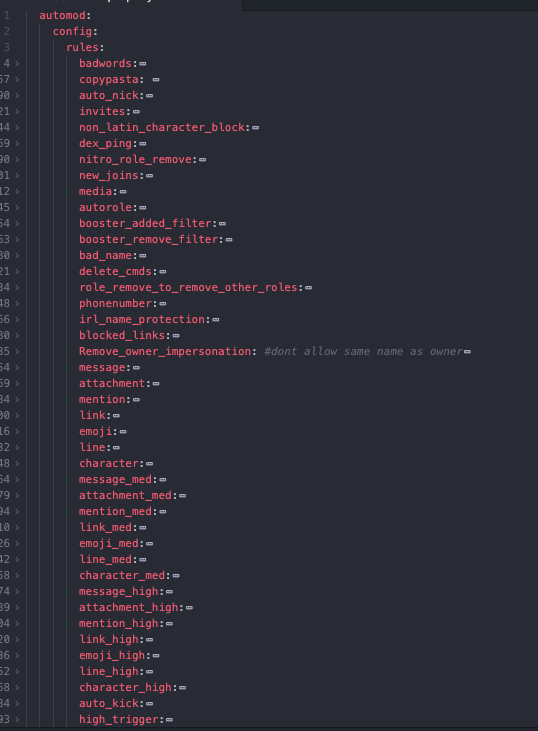
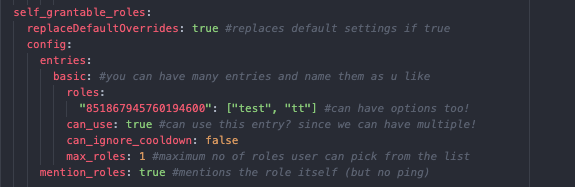

# Zep by DEX
Zeppelin is a moderation bot for Discord, and I am DEX....I dont know where I am going with this....Anyways

This is my repo for tips and tricks for Dragorys Bot

## Plugins Tips

### Follow User
**HOW TO GET ALERTED WHEN SOMEONE JOINS VC USING FOLLOW COMMAND**

`!f @DEX#5006 -d 9999h reminder message` everytime user joins/leaves vc, zep will ping u

`!fs` shows a list of all your alerts you set up
example output:

`1.` Target: @banana

`2.` Target: @pear

`!fs d 1` deletes the first alert from the list


-----------------------------------------

### Reminder


### Utility

#### Avatar


#### Jumbo


#### Search
🚩 **SEARCH FLAGS**

`!s -sort id dex` sort all dex results by ID

`!s -bot` lists all bots

`!s -p 1 dex` search page 1 of dex results

`!s -e` export results (via a link)

`!s -ids` excludes usernames and lists only ids

`!s -re dex` regex search for users named dex

`!s -v` lists all ppl in vc

Examples:
`!s -ids -e dex` exports all ids of users named dex on server
Note: *the results can be used for `!massban` command afterwards*

-----------------------------------------
#### Clear
🗒️ **CLEAN MESSAGES FROM USER AND ADD TO CASE**
`!clear <count> -u userid -c #channel -update`

Note: the `-update` at the end is if you want to add it to their mod log case
-----------------------------------------

### Mutes
**HOW TO USE AGE AND EXPORT FLAGS IN MUTE COMMAND**
`-export` simply exports the result to an archive link
e.g: `!mutes -e` would give you a link rather than show it all on the channel

`-age` allows you to restrict the command to only show mutes older than X period
e.g: `!mutes -age 2h` would only show mutes that have been active for 2h or longer
-----------------------------------------

### Welcome
**WELCOME PLUGIN VARIABLES**
`member`, `user`, and `guild`

Usage:
welcome `{user.username}` to `{guild.name}!`
welcome `<@!{user.id}>!`

### Counters
COUNTER TIP

Counter decays are currently processed every 5 minutes. They are, however, still applied according to the decay time, even if it's lower than 5 minutes, so "1 every 30s" would decay 10 points at once every 5 minutes.

-----------------------------------------

### Cases
⏲️ **RELATIVE TIME**
`relative_time_cutoff: 7d`

`relative_time_cutoff` is the amount of time after which `!cases` will show the full date, not a relative time (e.g. "5 hours ago")

so if you set relative time cutoff to 24h, any cases older than 24h would show the full date, e.g. "2021-01-30", rather than e.g. "1 day ago"

-----------------------------------------

### Logs
**COMMAND LOG VARIABLE**
This log type is not functional unfortunately. So just skip it!

-----------------------------------------

### Tags

💡 **TAG TIP**

`user_tag_cooldown`is the cooldown per user per tag
`global_tag_cooldown` is the global cooldown (server wide) per tag
`user_cooldown` is the cooldown per user (not tag specific)
`global_cooldown` is the global cooldown (server wide) (not tag specific)


**TAGS RESOURCES**

`member / user` here:
https://github.com/Dragory/ZeppelinBot/blob/master/backend/src/plugins/Tags/util/renderTagFromString.ts#L30

base template functions (also available in other places with variables) here:
https://github.com/Dragory/ZeppelinBot/blob/master/backend/src/templateFormatter.ts#L261

tag functions here:
https://github.com/Dragory/ZeppelinBot/blob/master/backend/src/plugins/Tags/TagsPlugin.ts#L116

and a few extra tag things here:
https://github.com/Dragory/ZeppelinBot/blob/master/backend/src/plugins/Tags/util/renderTagBody.ts#L20

useful doc
https://gist.github.com/vcokltfre/8cff17725485f70992c44970f53977fd

-----------------------------------------

### Others

**Override Tip**

Overrides are always calculated top down

For example:
If you want to have mods messages not be deleted, your overrides would need to be in this order:

1. Enable in channel xyz
2. Disable for mods
If you have it the other way round it'll delete everything, even from mods.
```yml
    overrides:

    - role: "766285827612999752" #disable rule once role is given
      config:
        rules:
          autorole:
            enabled: false

    - level: '>=50'
      config:
        can_view_antiraid: true
        can_set_antiraid: true
        rules:
          badwords:
            enabled: false
          copypasta:
            enabled: false
```
-----------------------------------------

### Example Shots






See https://zeppelin.gg/ for more details.

## Contributing
Pull requests are welcome. For major changes, please open an issue first to discuss what you would like to change.
## More Info

You can find me on the zeppelin support server!
at https://discord.gg/9bCGvGw5rT
