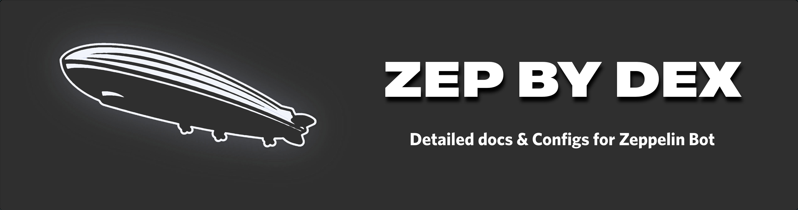

# ZEP BY DEX

Zeppelin is a moderation bot for Discord, and I am DEX....

This is my repo for tips and tricks for Zeppelin bot

**CONSIDER PUTTING A ⭐️ ON THIS REPO**

## PLUGINS:

You can join my server and follow github channel for updates or to play with Zeppelin

---

|                                            	|                   **PLUGINS**                   	|                                             	|
|:------------------------------------------:	|:-----------------------------------------------:	|:-------------------------------------------:	|
|         [Autodelete](autodelete.md)        	|    [Automod & Counters](automod+counters.md)    	|          [Automod Rules](rules.md)          	|
|      [Autoreactions](autoreactions.md)     	|                [Cases](cases.md)                	| [Companion Channels](companion_channels.md) 	|
|          [Locate User](locate.md)          	|                 [Logs](logs.md)                 	|      [Miscellaneous](miscellaneous.md)      	|
| [Mutes & Mod actions](mutes&modactions.md) 	|              [Persist](persist.md)              	|     [Pingable roles](pingable_roles.md)     	|
|               [Post](post.md)              	|       [Reaction Roles](reaction_roles.md)       	|           [Reminders](reminder.md)          	|
|              [Roles](roles.md)             	| [Self grantable roles](self_grantable_roles.md) 	|           [Slowmode](slowmode.md)           	|
|          [Starboard](starboard.md)         	|                 [Tags](tags.md)                 	|      [Time and Date](time_and_date.md)      	|
|            [Utility](utility.md)           	|      [Welcome Message](welcome_message.md)      	|                                             	|

Note: The following plugins are omitted:

- Spam protection (Legacy Plugin)
- Censor (Legacy Plugin)
### Example Shots

See https://zeppelin.gg/ for more details.

## Contributing
Pull requests are welcome. For major changes, please open an issue first to discuss what you would like to change.
## More Info

You can also find me on the zeppelin support server
