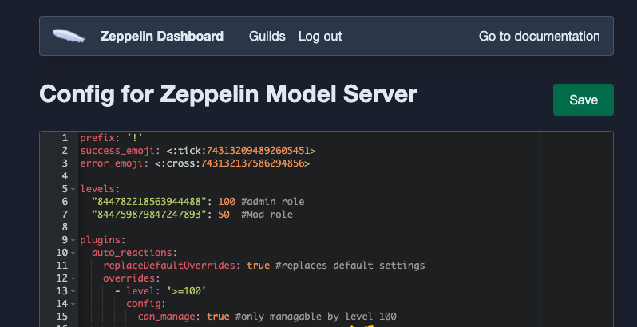

# ZEP BY DEX


**CONSIDER PUTTING A ⭐️ ON THIS REPO**

### What is Zeppelin ?

>Zeppelin is a bot that offers high level of customization, its basically build a bot where you decide what you want the bot to do.

### How to use zep ?

> You use zep via online dashboard, unlike most dashboard you control the entire thing by updating just one file (its called a yaml file). There are various plugins/modules that you enable and customize.

### Where do I start ?

The bot works as follows, you can have levels from 1 to 100. By default, zeppelin assumes mod as level 50, and admin as level 100 but you can change that once you get used to the bot.

**Step 1:** Set the prefix

**Step 2:** Insert role IDs for level 50 and 100

**Step 3:** Type plugins

 This is where you will start enabling modules later on

**EXAMPLE SETUP**

The image below shows what the dashboard looks like after you set all these. In this example we enabled the `auto_reactions` plugin. Note that the `success_emoji` and `error_emoji` are optional if you want to set your own you can but if you dont type anything, it will use the default.



## CONFIG FOR NEW USERS

> Note: This excludes Counters, companion_channels, persist, roles, self_grantable_roles, starboard & tags plugins as they are not often used by starters. But this should get you off to a good start with default settings on zep!

<details>
  <summary>Click to view beginners config!</summary>

```yaml
prefix: '!'

levels:
  "844782218563944488": 100 #admin role
  "844759879847247893": 50  #Mod role

plugins:
  post: {}
  reminders: {}
  auto_reactions: {}
  locate_user: {}
  reaction_roles: {}
  slowmode: {}
  utility: {}
  time_and_date: {}
  pingable_roles: {}

  cases:
    config:
      case_log_channel: "854373344232865832" #cases channel id

  mutes:
    config:
      mute_role: "777121217630175243" #muterole id here

  mod_actions:
    config:
      dm_on_kick: true
      dm_on_ban: true
      
 
  welcome_message:
    config:
      send_dm: true
      message: |-
              **Welcome to Dexter's Laboratory**
              
              **Invite others with**
              https://discord.gg/... 

  logs:
    config:
      channels:
        '761972021612904519': #log channel id here 
          exclude: [] #exclude nothing, include everythinh
      format:
        timestamp: ""

  automod:
    config:
      rules:
        badwords: #badwords
          enabled: true
          triggers:
          - match_words:
              words: [
                "﷽","﷽", "|", "⣿",
                "pornhub", "seggz", "dildo", "edp445", "卍", "simping", "slmp", "slmps",
                "simp", "s1mp", "simps", "s1mps", "biitch", "tards", "Fäg", "sex", 
                "virgin", "ræpe", "sexual", "r*pist", "r*apist", "r*pe",
                "superstraight", "bitch", "bitches", "b1tch", "b1tches",
                "milf", "milfs", "xp grind", "raped", "Cum", "Rape", "kys", "kill yourself",
                "cumming", "autist", "raping", "porn", "pornography", "anal", "cunt", "cnut",
                "pussy", "cock", "cocks", "c0ck", "hentai", "shemale", "pedophile", "pedo", 
                "nazi", "porno", "puta", "semen", "slut", "twat", "wank", "loli", "rape",
                "rapist", "lolis", "tits", "boob", "boobies", "tit", "nude", "nudes", "vagina",
                "retard", "braindead", "hoe", "libtard", "titty", "porn", "thot", 
                "sperg", "dick", "hoes", "retrad", "penis", "whore", "suicide", "kill myself", 
                "cuck", "blowjob", "raping", "boobs", "retarded", "incel", "retards", "incel",
                "cunts", "tarded", "discord.gift", "lolicon", "loli","⣠", "⡖","⠋", "⠉","⠛",
                "testicals","卐", "ching chong", "Fag"]
              case_sensitive: true
              only_full_words: true
              normalize: true
              loose_matching: false
              loose_matching_threshold: 0
              strip_markdown: true
              match_messages: true
              match_embeds: true
              match_visible_names: false
          - match_regex:
              patterns:
                #- 'fuck'
                - 'afak'
                - 'n[il1]+g{2,}(er|a)' #nigger
                - "n[\\s.\\-]*[i1][\\s.\\-]*[g6][\\s.\\-]*[g6][\\s.\\-]*[e3][\\s.\\-]*r" #nigger
                - "n[\\s.\\-]*[i1][\\s.\\-]*[g6][\\s.\\-]*[g6][\\s.\\-]*a" #nigga
                - "f[\\s.\\-]*a[\\s.\\-]*[g6][\\s.\\-]*[g6][\\s.\\-]*o[\\s.\\-]*[t7]" #faggot
              normalize: true
              strip_markdown: true
              match_messages: true
              match_embeds: true
              match_visible_names: false
          actions:
            clean: false
            reply:
              text: 
                content: "<@{user.id}> Whoa :p"
              auto_delete: 3s


        copypasta: #copy paste spam
          enabled: true
          triggers:
            - match_regex:
                patterns: 
                  - "[⠁⠂⠃⠄⠅⠆⠇⠈⠉⠊⠋⠌⠍⠎⠏⠐⠑⠒⠓⠔⠕⠖⠗⠘⠙⠚⠛⠜⠝⠞⠟⠠⠡⠢⠣⠤⠥⠦⠧⠨⠩⠪⠫⠬⠭⠮⠯⠰⠱⠲⠳⠴⠵⠶⠷⠸⠹⠺⠻⠼⠽⠾⠿]"
                  - "[░▐▌█▀▄]"
                  - \# - "^(\\s*\\|\\|.+?\\|\\|\\s*)+$" 
                  - (?:[\u2500-\u25FF\u2800-\u28FF]\s*){4,}
                  - '▐▀█▀▌'
                  - ⠟⠑⡄⠀⠀⠀⠀⠀⠀⠀ ⣀⣀⣤⣤⣤⣀⡀
                  - ඞ
                  - ████
                  - ⣿⣿⣿
                case_sensitive: false
                normalize: true
                strip_markdown: true
                match_messages: true
                match_embeds: true
          actions:
            log: true
            reply:
              text: 
                content: "<@{user.id}> No copypasta spam pls"
              auto_delete: 5s
    overrides:
    #Overrides are always calculated top down
    #For example:
    #If you want to have mods messages not be deleted, your overrides would need to be in this order:

    #1. Enable in channel xyz
    #2. Disable for mods
    #If you have it the other way round it'll delete everything, even from mods.

    - level: '>=50' #mods are not affected as its disabled for them
      config:
        can_view_antiraid: true #can view the antiraid level
        can_set_antiraid: true #can set the antiraid level
        rules:
          badwords:
            enabled: false 
          copypasta:
            enabled: false
```

</details>

---

## CONFIG FOR FAMILAR USERS

> Note: This config includes **ALL** the plugins zeppelin has to offer and should be more than enough for 90% of the servers!

<details>
  <summary>Click to view medium difficulty config!</summary>

```yaml
prefix: '!'

levels:
  "844782218563944488": 100 #admin role
  "844759879847247893": 50  #Mod role

plugins:
  post: {}
  reminders: {}
  auto_reactions: {}
  locate_user: {}
  reaction_roles: {}
  slowmode: {}
  utility: {}
  time_and_date: {}
  pingable_roles: {}

  cases:
    config:
      case_log_channel: "854373344232865832" #cases channel id

  mutes:
    config:
      mute_role: "777121217630175243" #muterole id here

  mod_actions:
    config:
      dm_on_kick: true
      dm_on_ban: true
      
 
  welcome_message:
    config:
      send_dm: true
      message: |-
              **Welcome to Dexter's Laboratory**
              
              **Invite others with**
              https://discord.gg/... 

  logs:
    config:
      channels:
        '761972021612904519': #log channel id here 
          exclude: [] #exclude nothing, include everythinh
      format:
        timestamp: ""

  auto_delete:
    config:
      enabled: false
      delay: 5s
    overrides:
      - channel: "109672661671505920" #channel id
        config:
          enabled: true
          delay: 5s
      - level: '>=50' #mods are not affected as its disabled for them
        config:
          enabled: false

  companion_channels:
    config:
      entries:
        public_vcs: #name of the entry, could be anything
          voice_channel_ids: 
            - "799704245338112050" #voice vc
            - "855391042227404820" #music vc
          text_channel_ids:
            - "854374779691728946" # vc text
          #this can be calculated using https://discordapi.com/permissions.html
          permissions: 1024
          enabled: true

  persist:
    config:
      persisted_roles:
        - "844759879847247893" #member role id here
      persist_nicknames: true
      persist_voice_mutes: true

  self_grantable_roles:
    config:
      entries:
        basic: #you can have many entries and name them as u like
          roles:
            "762164188922904607": ["announce", "alert", "alerts"] #can have options too!
          can_use: true #can use this entry? since we can have multiple!
          can_ignore_cooldown: true #does nothing i guess? not sure ask #support
          max_roles: 1 #maximum no of roles user can pick from the list
      mention_roles: true #mentions the role itself (but no ping)

  roles:
    config:
      assignable_roles: #roles u can add to another user
        - '558037973581430785'
        - '875361358907060295'
    overrides:
      - level: '>=50'
        config:
          can_assign: true #level 50 and up can assign
      - level: '>=100'
        config:
          can_mass_assign: true # level 100 can mass assign and remove roles

  starboard:
    config:
      boards:
        basic:
          channel_id: "604342689038729226"
          stars_required: 5

  tags:
    config:
      prefix: "!"
      delete_with_command: true ##delete_with_command would delete the bot response when the original message is deleted
      user_tag_cooldown: null #user_tag_cooldown is the cooldown per user per tag
      global_tag_cooldown: null #global_tag_cooldown is the global cooldown (server wide) per tag
      user_cooldown: 10s #user_cooldown is the cooldown per user (not tag specific)
      allow_mentions: false #allow tags to ping?, Can be enabled conditionally via overrides for e.g. only moderators
      global_cooldown: null #global_cooldown is the global cooldown (server wide) (not tag specific)
      auto_delete_command: false #When turned on, the message triggering a tag will be automatically deleted after the tag is posted
      can_create: false
      can_use: true
      can_list: true
      categories:
        "mental": 
          tags:
            "health":
              embed:
                title: "Mental Health Resources"
                color: 0xFF0000
                footer: 
                  text: "Remember, You Matter <3"
                  icon_url: https://media.discordapp.net/attachments/770256340639416320/854689949193076737/Medical_31-60_974.jpg?width=523&height=523
                #image: 
                  #url: https://i.pinimg.com/originals/f6/f6/e6/f6f6e629e0bb1ab4ef763c12b5457074.png
                thumbnail: 
                  url: https://media.discordapp.net/attachments/770256340639416320/854690141279748096/PngItem_4479310.png?width=523&height=523
                fields:
                -  name: "**National Suicide Prevention Hotline (U.S.):**"
                   value: |
                    **Call:** 1-800-273-8255, available 24/7 for emotional support
                    **Text: HOME** to 741741
                    https://suicidepreventionlifeline.org/chat/
                    
                    Outside the U.S: Find a supportive resource on [this Wikipedia list of worldwide crisis hotlines](https://en.wikipedia.org/wiki/List_of_suicide_crisis_lines)
                   inline: false
                -  name: "**More Support**"
                   value: |
                    For Substance Abuse Support, Eating Disorder Support & Child Abuse and Domestic Violence:
                    [Click to go to Discord's Health & Safety Page](https://discord.com/safety/360044103771-Mental-health-on-Discord#h_01EGRGT08QSZ5BNCH2E9HN0NYV)

  counters:
    config:
      counters:
        automod_infractions:
          per_user: true
          triggers:
            # When a user accumulates 100 or more (>=100) automod infraction points, this trigger will activate
            # The numbers here are arbitrary - you could choose to use 10 or 1000 instead.
            too_many_infractions:
              condition: ">=100"
          # Remove 100 automod infraction points per hour
          decay:
            amount: 100
            every: 1h
            
  automod:
    config:
      rules:
        badwords: #badwords
          enabled: true
          triggers:
          - match_words:
              words: [
                "﷽","﷽", "|", "⣿",
                "pornhub", "seggz", "dildo", "edp445", "卍", "simping", "slmp", "slmps",
                "simp", "s1mp", "simps", "s1mps", "biitch", "tards", "Fäg", "sex", 
                "virgin", "ræpe", "sexual", "r*pist", "r*apist", "r*pe",
                "superstraight", "bitch", "bitches", "b1tch", "b1tches",
                "milf", "milfs", "xp grind", "raped", "Cum", "Rape", "kys", "kill yourself",
                "cumming", "autist", "raping", "porn", "pornography", "anal", "cunt", "cnut",
                "pussy", "cock", "cocks", "c0ck", "hentai", "shemale", "pedophile", "pedo", 
                "nazi", "porno", "puta", "semen", "slut", "twat", "wank", "loli", "rape",
                "rapist", "lolis", "tits", "boob", "boobies", "tit", "nude", "nudes", "vagina",
                "retard", "braindead", "hoe", "libtard", "titty", "porn", "thot", 
                "sperg", "dick", "hoes", "retrad", "penis", "whore", "suicide", "kill myself", 
                "cuck", "blowjob", "raping", "boobs", "retarded", "incel", "retards", "incel",
                "cunts", "tarded", "discord.gift", "lolicon", "loli","⣠", "⡖","⠋", "⠉","⠛",
                "testicals","卐", "ching chong", "Fag"]
              case_sensitive: true
              only_full_words: true
              normalize: true
              loose_matching: false
              loose_matching_threshold: 0
              strip_markdown: true
              match_messages: true
              match_embeds: true
              match_visible_names: false
          - match_regex:
              patterns:
                #- 'fuck'
                - 'afak'
                - 'n[il1]+g{2,}(er|a)' #nigger
                - "n[\\s.\\-]*[i1][\\s.\\-]*[g6][\\s.\\-]*[g6][\\s.\\-]*[e3][\\s.\\-]*r" #nigger
                - "n[\\s.\\-]*[i1][\\s.\\-]*[g6][\\s.\\-]*[g6][\\s.\\-]*a" #nigga
                - "f[\\s.\\-]*a[\\s.\\-]*[g6][\\s.\\-]*[g6][\\s.\\-]*o[\\s.\\-]*[t7]" #faggot
              normalize: true
              strip_markdown: true
              match_messages: true
              match_embeds: true
              match_visible_names: false
          actions:
            clean: false
            reply:
              text: 
                content: "<@{user.id}> Whoa :p"
              auto_delete: 3s


        copypasta: #copy paste spam
          enabled: true
          triggers:
            - match_regex:
                patterns: 
                  - "[⠁⠂⠃⠄⠅⠆⠇⠈⠉⠊⠋⠌⠍⠎⠏⠐⠑⠒⠓⠔⠕⠖⠗⠘⠙⠚⠛⠜⠝⠞⠟⠠⠡⠢⠣⠤⠥⠦⠧⠨⠩⠪⠫⠬⠭⠮⠯⠰⠱⠲⠳⠴⠵⠶⠷⠸⠹⠺⠻⠼⠽⠾⠿]"
                  - "[░▐▌█▀▄]"
                  - \# - "^(\\s*\\|\\|.+?\\|\\|\\s*)+$" 
                  - (?:[\u2500-\u25FF\u2800-\u28FF]\s*){4,}
                  - '▐▀█▀▌'
                  - ⠟⠑⡄⠀⠀⠀⠀⠀⠀⠀ ⣀⣀⣤⣤⣤⣀⡀
                  - ඞ
                  - ████
                  - ⣿⣿⣿
                case_sensitive: false
                normalize: true
                strip_markdown: true
                match_messages: true
                match_embeds: true
          actions:
            log: true
            reply:
              text: 
                content: "<@{user.id}> No copypasta spam pls"
              auto_delete: 5s

        # An example automod rule that adds automod infraction points
        some_infraction:
          triggers:
            - match_words:
                words: ['poopoo head']

          actions:
            clean: true
            reply: 'Do not insult other users'
            add_to_counter:
              counter: "automod_infractions"
              amount: 25 # This infraction adds 25 automod infraction points

        # An example rule that is triggered when the user accumulates too many automod infraction points
        automute_on_too_many_infractions:
          triggers:
            - counter_trigger:
                counter: "automod_infractions"
                trigger: "too_many_infractions"

          actions:
            mute:
              reason: "You have been muted for tripping too many automod filters"
              remove_roles_on_mute: true
              restore_roles_on_mute: true

    overrides:
    #Overrides are always calculated top down
    #For example:
    #If you want to have mods messages not be deleted, your overrides would need to be in this order:

    #1. Enable in channel xyz
    #2. Disable for mods
    #If you have it the other way round it'll delete everything, even from mods.

    - level: '>=50' #mods are not affected as its disabled for them
      config:
        can_view_antiraid: true #can view the antiraid level
        can_set_antiraid: true #can set the antiraid level
        rules:
          badwords:
            enabled: false 
          copypasta:
            enabled: false
            
```

</details>

---

## CONFIG FOR POWER USERS

> Note: This is madlad stuff. This is wild as shit. You probably need to be insane to use this. It has everything, counters, escalations,  leveling, antiraid, autorole...BUTTONS?!!! CONTEXT MENUS. Truely a power users dream. Might as well fire half your mod team.

<details>
  <summary>Click to view madlad difficulty config!</summary>

```yaml
prefix: '!'
success_emoji: <:tick:743132094892605451>
error_emoji: <:cross:743132137586294856>

#aliases:
  #- &admin "844782218563944488" # level 100 role
  #- &mod "844759879847247893" #level 50 role
  #- &autodelete "800012874113220669" #channelID
  #- &companionvc "124"  #companion vc channel
  #- &companiontext "123" #companion text
  #- &member "123" #persist role
  #- &botusage "124" #channelID

levels:
  "844782218563944488": 100 #admin role
  "844759879847247893": 50  #Mod role
  #[*admin]: 100
  #[*mod]: 50


plugins:
  post:
    replaceDefaultOverrides: true #replaces default settings if true
    overrides:
      - level: '>=100'
        config:
          can_post: true #only level 100 can post (use this plugin)

  reminders:
    replaceDefaultOverrides: true 
    config:
      can_use: true

  auto_reactions:
    replaceDefaultOverrides: true 
    overrides:
      - level: '>=100'
        config:
          can_manage: true

  locate_user:
    replaceDefaultOverrides: true 
    overrides:
      - channel:
        - "799195773408903188" #bot usage
        #- channel: *botusage
        config:
          can_where: true
          can_alert: true

  reaction_roles:
    replaceDefaultOverrides: true #replaces default settings if true
    config:
      auto_refresh_interval: 900000 #re-adds reactions after x seconds
      remove_user_reactions: true #remove user reaction or let it stay
      
      
       #button_groups:
        #testgroup:
          #message: "Come and get your self-assignable roles!"
          #default_buttons:
            #admin:
              #label: "Get Admin" #label of button
              #emoji: "861342977683357706" #emojiID on button
              #role_or_menu: "860535599186444349" #give role or open another menu
              #type: "SUCCESS"
              #end_row: true #end or continue?
              
            #menuopen1:
              #label: "Recursive Menu"
              #emoji: "861343089641259028"
              #role_or_menu: "menu1"
              #type: "PRIMARY"
              
          #button_menus:
            #menu1:
              #menureopen1:
                #label: "Recursive, poggers" #label of button
                #role_or_menu: "menu1" #opens menu after button press
                #ends_row: false #keeps on going looking for menus
 
    overrides:
      - level: '>=100'
        config:
          can_manage: true #only level 100 can manage

  companion_channels:
    config:
      entries:
        public_vcs: #name of the entry, could be anything
          voice_channel_ids: 
            - "799704245338112050" #voice vc
            - "855391042227404820" #music vc
          text_channel_ids:
            - "854374779691728946" # vc text
          #this can be calculated using https://discordapi.com/permissions.html
          permissions: 1024
          enabled: true

  persist:
    replaceDefaultOverrides: true #replaces default settings if true
    config:
      persisted_roles:
        #- "844759879847247893" #moderator
        
        #- "762164188922904607" #alerts
        
        #- "827840992111099935" #Bronze
        #- "827841264489725983" #Silver
        #- "827841321716678698" #Gold
        #- "827841368374247454" #Platinum
        
        #- "828659945158737931" #Regulars

        #- "808718941785554985" #⭐️ star

        - "123" #dexians
      persist_nicknames: true
      persist_voice_mutes: true

  self_grantable_roles:
    replaceDefaultOverrides: true 
    config:
      entries:
        basic: #you can have many entries and name them as u like
          roles:
            "762164188922904607": ["announce", "alert", "alerts"] #can have options too!
          can_use: true #can use this entry? since we can have multiple!
          can_ignore_cooldown: true #does nothing i guess? not sure ask #support
          max_roles: 1 #maximum no of roles user can pick from the list
      mention_roles: true #mentions the role itself (but no ping)

  slowmode:
    replaceDefaultOverrides: true 
    config:
      use_native_slowmode: true #use discord's built in slowmode (till 6h)
      is_affected: true #everyone except those in override are affected
    overrides:
      - level: '>=50'
        config:
          can_manage: true #can set and manage slowmode commands
          is_affected: false #level 50 and up arent affected by slowmode

  roles:
    replaceDefaultOverrides: true 
    config:
      assignable_roles: #roles u can add to another user
        - '558037973581430785'
        - '875361358907060295'
    overrides:
      - level: '>=50'
        config:
          can_assign: true #level 50 and up can assign
      - level: '>=100'
        config:
          can_mass_assign: true # level 100 can mass assign and remove roles

  pingable_roles: #makes a role pingable when you start typing in a specific channel
    replaceDefaultOverrides: true #replaces default settings if true
    overrides:
      - level: '>=100'
        config:
          #Usage: !pingable_role <channelId> <role>
          #To disable: !pingable_role disable <channelId> <role>
          can_manage: true #only level 100 can run that ^

  welcome_message:
    replaceDefaultOverrides: true #replaces default settings if true
    config:
      send_dm: true
      send_to_channel: "851851771717353512" #welcome channel
      message: |-
              **Welcome to Dexter's Laboratory**
              
              **Invite others with**
              https://discord.gg/JCZf3sHYpE 

  time_and_date:
    replaceDefaultOverrides: true #replaces default settings if true
    config:
      #https://en.wikipedia.org/wiki/List_of_tz_database_time_zones for list
      timezone: Asia/Karachi
      can_set_timezone: true #set your own timezone via !timezone <timezone>, reset with !timezone reset and view with !timezone
      date_formats:
        date: 'D MMM, YYYY'
        time: 'H:mm'
        pretty_datetime: 'D MMM, YYYY [at] H:mm z'
        # https://gist.github.com/Skipants/788819

  starboard:
    replaceDefaultOverrides: false #replaces default settings if true
    config:
      boards:
        basic: #starboard no1, u can name anything
          channel_id: "33454" #starboard
          stars_required: 88
          #star_emoji: [":<:star:870570007753531452>:"]
          copy_full_embed: true
          enabled: true # The starboard is enabled for all
          show_star_count: true #show the star-count in starboard
          #color: 0x000080

        basic2:
          channel_id: "872366278050979850" #starboard
          star_emoji: ["⭐", "<a:star:870570007753531452>"]
          stars_required: 1

        levelonly: #starboard no2, u can name anything
          channel_id: "830321220943347772"
          stars_required: 0
          star_emoji: [":rat:", "🐀"] #multiple various reactions possible!
          copy_full_embed: true
          show_star_count: true #show the star-count in starboard
          #color: 0x000080 if needed
      #can_migrate command can be used to move ("migrate") pins to a starboard
      can_migrate: false
    overrides:
      - level: "100"
        config:
          boards:
            levelonly:
              enabled: true #only for level 100 (admin react = starboard)

  cases:
    replaceDefaultOverrides: true #replaces default settings if true
    config:
      log_automatic_actions: true
      case_log_channel: "854373344232865832" #cases channel
      show_relative_times: true
      #relative_time_cutoff is the amount of time after which !cases will show the full date, not a relative time (e.g. "5 hours ago")
      #if you set relative time cutoff to 24h, any cases older than 24h would show the full date, e.g. "2021-01-30", rather than e.g. "1 day ago"
      relative_time_cutoff: 7d
      case_colors: #to enable these options, delete the # infront of the items below
        warn: fdfd96 #yellow
        ban: ff6666 #red
        unban: 77dd77 #green
        note: white 
        kick: ffb347 #pastel orange
        mute: ff6666 #red
        unmute: 77dd77 #green
        deleted: orange
        softban: ff6666 #red
      case_icons:
        warn: ":warning:"
        ban: ":hammer:"
        unban: ":green_circle:"
        note: ":pencil:"
        kick: ":boot:"
        mute: ":mute:"
        unmute: ":green_circle:"
        deleted: ":no_entry:"
        softban: ":boot:"
        #for custom emoji "<:do_not_disturb:841799310797832244>"

  utility:
    config:
      can_roles: false #list or search roles
      can_level: true #permission level
      can_search: true #search or bansearcg
      can_clean: false #clean messages
      can_info: true #basic info + other sub modules
      can_server: true #serverinfo
      can_inviteinfo: true #invite info
      can_channelinfo: true #info about channel
      can_messageinfo: true #message details
      can_userinfo: true #other users info
      can_snowflake: true #snowflake info
      can_reload_guild: false #reload guild
      can_nickname: false #set nickname for others
      can_ping: true #can ping bot
      can_source: true #can see source of any ID
      can_vcmove: false #move someone from vc
      can_help: false #see docs help snippet
      can_about: true #!about
      can_context: true #context of message
      can_jumbo: true #jumbo emote
      jumbo_size: 128
      can_avatar: true
      info_on_single_result: true 
    overrides:
      - level: '>=50'
        config:
          can_roles: true
          can_level: true
          can_search: true
          can_clean: true
          can_info: true
          can_server: true
          can_inviteinfo: true
          can_channelinfo: true
          can_messageinfo: true
          can_userinfo: true
          can_snowflake: true
          can_nickname: true
          can_vcmove: true
          can_help: true
          can_context: true
          can_jumbo: true
          can_avatar: true
          can_source: true
      - level: '>=100'
        config:
          can_reload_guild: true
          can_ping: true
          can_about: true

  tags:
    replaceDefaultOverrides: false #replaces default settings if true
    config:
      prefix: "!"
      delete_with_command: true ##delete_with_command would delete the bot response when the original message is deleted
      user_tag_cooldown: null #user_tag_cooldown is the cooldown per user per tag
      global_tag_cooldown: null #global_tag_cooldown is the global cooldown (server wide) per tag
      user_cooldown: 10s #user_cooldown is the cooldown per user (not tag specific)
      allow_mentions: false #allow tags to ping?, Can be enabled conditionally via overrides for e.g. only moderators
      global_cooldown: null #global_cooldown is the global cooldown (server wide) (not tag specific)
      auto_delete_command: false #When turned on, the message triggering a tag will be automatically deleted after the tag is posted
      can_create: false
      can_use: true
      can_list: true
      categories:
        "mental": 
          tags:
            "health":
              embed:
                title: "Mental Health Resources"
                color: 0xFF0000
                footer: 
                  text: "Remember, You Matter <3"
                  icon_url: https://media.discordapp.net/attachments/770256340639416320/854689949193076737/Medical_31-60_974.jpg?width=523&height=523
                #image: 
                  #url: https://i.pinimg.com/originals/f6/f6/e6/f6f6e629e0bb1ab4ef763c12b5457074.png
                thumbnail: 
                  url: https://media.discordapp.net/attachments/770256340639416320/854690141279748096/PngItem_4479310.png?width=523&height=523
                fields:
                -  name: "**National Suicide Prevention Hotline (U.S.):**"
                   value: |
                    **Call:** 1-800-273-8255, available 24/7 for emotional support
                    **Text: HOME** to 741741
                    https://suicidepreventionlifeline.org/chat/
                    
                    Outside the U.S: Find a supportive resource on [this Wikipedia list of worldwide crisis hotlines](https://en.wikipedia.org/wiki/List_of_suicide_crisis_lines)
                   inline: false
                -  name: "**More Support**"
                   value: |
                    For Substance Abuse Support, Eating Disorder Support & Child Abuse and Domestic Violence:
                    [Click to go to Discord's Health & Safety Page](https://discord.com/safety/360044103771-Mental-health-on-Discord#h_01EGRGT08QSZ5BNCH2E9HN0NYV)

        "commands":
          tags:
            "commands":
              embed:
                title: "Zeppelin Commands"
                color:  0x2f3136 #blank
                fields:
                -  name: "**Mod actions**"
                   value: |
                    **__?addcase__** - Add an arbitrary case to the specified user without taking any action
                    **__?ban/?ban <time>__** - Ban or Tempban the specified member
                    **__?case__**  - Show information about a specific case
                    **__?cases/?modlogs__** - Show a list of cases the specified user has
                    **__?cases / ?modlogs / ?infractions__** - Show the most recent 5 cases by the specified -mod
                    **__?delete_case / ?deletecase__** - Delete the specified case. This operation can not be reversed. It is generally recommended to use `!hidecase` instead when possible.
                    **__?forceban__** - Force-ban the specified user, even if they aren't on the server
                    **__?forcemute__**- Force mute the specified user, even if they're not on the server
                   inline: false
                -  name: "**------**"
                   value: |
                    **__?forceunmute__** - Force unmute the specified user, even if they're not on the server
                    **__?hide / ?hidecase / ?hide_case__ **- Hide the specified case so it doesn't appear in `?cases` or `?info`
                    **__?kick__** - Kick the specified member
                    **__?massban__** - Mass ban a list of user IDs
                    **__?massmute__** - Mass mute a list of user IDs
                    **__?massunban__** - Mass unban a list of user IDs 
                    **__?unban__** - Unban the specified member
                    **__?mute__** - Mute the specified member
                   inline: false
                -  name: "**------**"
                   value: |
                    **__?note__** - Add a note to the specified user
                    **__?unhide / ?unhidecase / ?unhide_case__** - Unhide the specified case, making it appear in `?cases` and `?info` again
                    **__?unmute__** - Unmute the specified member
                    **__?update / ?reason__** - Update the specified case (or, if case number is omitted, your latest case) by adding more notes/details to it
                    **__?warn__** - Send a warning to the specified user
                   inline: false
                -  name: "**------**"
                   value: |
                      **__?bansearch / ?bs__** - Search banned users. Basic usage: `?bansearch <user>`
                      **__?clean / ?clear__** - Remove a number of recent messages. Basic usage: `?clean 20`
                      **__?vcdisconnect / ?vcdisc / ?vcdc / ?vckick / ?vck__** - Disconnect a member from their voice channel. Basic usage: `?vcdc <@user>`
                      **__?vcmove__** - Move a member to another voice channel. Basic usage: `?vcmove <@user> 473223047822704651`
                      **__?vcmoveall__** - Move all members of a voice channel to another voice channel. Basic usage: `?vcmoveall 551767166395875334 767497573560352798

        "misc": 
           tags:
            "misc":
              embed:
                title: "Misc Commands"
                color: 0x2f3136 #blank
                fields:
                -  name: "**Post**"
                   value: |
                    **__?edit__**
                    **__?edit_embed__**
                    **__?post__**
                    **__?post_embed__** - Optional: `<channel> <maincontent> [-title] [-content] [-color] [-raw] [-schedule] [-repeat] [-repeat-until] [-repeat-times]`
                    **__?scheduled_posts / ?scheduled_posts show__**
                    **__?scheduled_posts / ?scheduled_posts list__**
                    **__?scheduled_posts delete / ?scheduled_posts d__**
                   inline: false
                -  name: "**Reminders**"
                   value: |
                    **__?remind / ?remindme / ?reminder __**- Basic usage: `?remind 3h Remind me of this in 3 hours please`
                    **__?reminders__**
                    **__?reminders delete / ?reminders d__**
                   inline: false
                -  name: "**Utilities**"
                   value: |
                    **__?context__** - Get a link to the context of the specified message. Basic usage: `!context 94882524378968064 650391267720822785`
                    **__?help__** - Show a quick reference for the specified command's usage. Basic usage: `!help clean`
                    **__?info__** - Show information about the specified thing. Basic usage: `?info`
                    **__?invite / ?inviteinfo__** - Show information about an invite. Basic usage: !invite overwatch
                    **__?jumbo__** - Makes an emoji jumbo
                    **__?message / ?messageinfo__** - Show information about a message. Basic usage: `?message 534722016549404673-534722219696455701`
                    **__?nickname / ?nick__** - Set a member's nickname. Basic usage: `?nickname 106391128718245888 <nickname>`
                    **__?nickname reset / ?nick reset__** - Reset a member's nickname to their username. Basic usage: `?nickname reset 106391128718245888`
                   inline: false
                -  name: "**------**"
                   value: |
                    **__?context__** - Get a link to the context of the specified message. Basic usage: `!context 94882524378968064 650391267720822785`
                    **__?help__** - Show a quick reference for the specified command's usage. Basic usage: `!help clean`
                    **__?info__** - Show information about the specified thing. Basic usage: `?info`
                    **__?invite / ?inviteinfo__** - Show information about an invite. Basic usage: !invite overwatch
                    **__?jumbo__** - Makes an emoji jumbo
                    **__?message / ?messageinfo__** - Show information about a message. Basic usage: `?message 534722016549404673-534722219696455701`
                    **__?nickname / ?nick__** - Set a member's nickname. Basic usage: `?nickname 106391128718245888 <nickname>`
                    **__?nickname reset / ?nick reset__** - Reset a member's nickname to their username. Basic usage: `?nickname reset 106391128718245888`
                   inline: false
                -  name: "**------**"
                   value: |
                    **__?ping__** - Test the bot's ping to the Discord API
                    **__?reload_guild__** - Reload the Zeppelin configuration and all plugins for the server. This can sometimes fix issues.
                    **__?roles__** - List all roles or roles matching a search.
                    **__?search / ?s__** - Search server members
                    **__?server / ?serverinfo__** - Show server information
                    **__?source__** - View the message source of the specified message id. Basic usage: `?source 534722219696455701`
                    **__?user / ?userinfo / ?whois__** - Show information about a user


    overrides:
      - level: '<50'
        config:
          can_use: true #can user use the tags ?
      - level: '>=50'
        config:
          can_use: true #can user use the tags ?
          can_create: true #can user create tags?
          can_list: true #can user view the tags list
          allow_mentions: false #only level 50 and up will a tag ping


  mutes:
    replaceDefaultOverrides: true #replaces default settings if true
    config:
      mute_role: "777121217630175243" #muterole here
      #move_to_voice_channel: "852040275404128257" #vc id
      kick_from_voice_channel: false #muted users are also immediately kicked from their current voice channel
      dm_on_mute: true 
      dm_on_update: true #updating mute time informs user
      message_on_mute: true
      message_on_update: true
      message_channel: "770256340639416320" #home message channel
      #mute_message for indefinite mutes
      mute_message: |-
        **MUTED FOREVER**
        <:iconmuted:837072273978294283><:dash:855062799659171850>{guildName}
        <:iconsupport:778924718153662495><:dash:855062799659171850>{reason}
        <:line:855055669824061460><:line:855055669824061460><:line:855055669824061460><:line:855055669824061460>

      #timed_mute_message for mutes with an expiration time
      timed_mute_message: |-
        **MUTED**
        <:iconmuted:837072273978294283><:dash:855062799659171850>{guildName}
        <:iconclock:811925897036038165><:dash:855062799659171850>{time}
        <:iconsupport:778924718153662495><:dash:855062799659171850>{reason}
        <:line:855055669824061460><:line:855055669824061460><:line:855055669824061460><:line:855055669824061460>

      update_mute_message: |-
        **UPDATE TO YOUR MUTED TIME**
        <:iconmuted:837072273978294283><:dash:855062799659171850>{guildName}
        <:iconclock:811925897036038165><:dash:855062799659171850>**YOUR NEW MUTED TIME IS:**{time}
        <:line:855055669824061460><:line:855055669824061460><:line:855055669824061460><:line:855055669824061460>
      remove_roles_on_mute: true #removes all roles upon mute or  : ["role 1", "role 2"] and those specific roles are removed upon mute
      restore_roles_on_mute: true #restores the roles when mute is over
      can_view_list: false #can view muted list via !mutes command
    overrides:
      - level: '>=50'
        config:
          can_view_list: true
      - level: '>=100'
        config:
        #Clear dangling mutes for members who have been banned
          can_cleanup: true

  mod_actions:
    config:
      dm_on_warn: true
      dm_on_kick: true
      dm_on_ban: true
      message_on_warn: true
      message_on_kick: true
      message_on_ban: true
      message_channel: "770256340639416320"
      warn_message: |-
        :warning: **WARNING**
        You have been warned on the {guildName} server
        <:iconsupport:778924718153662495><:dash:855062799659171850>{reason}
        <:line:855055669824061460><:line:855055669824061460><:line:855055669824061460><:line:855055669824061460>

      kick_message: |-
        :boot: **KICKED**
        You have been kicked from the {guildName} server
        <:iconsupport:778924718153662495><:dash:855062799659171850>{reason}
        <:line:855055669824061460><:line:855055669824061460><:line:855055669824061460><:line:855055669824061460>

      ban_message: |-
        :hammer: **BANNED**
        You have been banned from the {guildName} server
        <:iconsupport:778924718153662495><:dash:855062799659171850>{reason}
        <:line:855055669824061460><:line:855055669824061460><:line:855055669824061460><:line:855055669824061460>

      tempban_message: |-
        :hammer: **BANNED**
        You have been banned from the {guildName} server
        <:iconclock:811925897036038165><:dash:855062799659171850>{banTime}
        <:iconsupport:778924718153662495><:dash:855062799659171850>{reason}
         wait till time is up then you can join at https://discord.gg/JCZf3sHYpE
        <:line:855055669824061460><:line:855055669824061460><:line:855055669824061460><:line:855055669824061460>
      alert_on_rejoin: true
      alert_channel: null
      #if you have warn_notify_enabled: true, then warn_notify_threshold is the number of warnings the user must get before the !warn  command asks you "hey, this user has already been warned 5 times, warn them again?"
      warn_notify_enabled: true
      warn_notify_threshold: 5
      warn_notify_message: |-
        The user already has **{priorWarnings}** warnings!
         Please check their prior cases and assess whether or not to warn anyways.
         Proceed with the warning?
      ban_delete_message_days: 0
      can_note: false
      can_warn: false
      can_mute: false
      can_kick: false
      can_ban: false
      can_unban: false
      can_view: false
      can_addcase: false
      can_massunban: false
      can_massban: false
      can_massmute: false
      can_hidecase: false
      can_deletecase: false
      #can_act_as_other allows you to use the -mod option for commands such as !ban - this will set the case's moderator as the user you specify, and also mention your name below theirs if you view the case
      can_act_as_other: false
      #Manual actions wouls be stuff like right click ban, right click kick , it will create cases for those as well
      create_cases_for_manual_actions: true
    overrides:
      - level: '>=50'
        config:
          can_note: true
          can_warn: true
          can_mute: true
          can_kick: true
          can_ban: true
          can_unban: true
          can_view: true
          can_addcase: true
      - level: '>=100'
        config:
          can_massunban: true
          can_massban: true
          can_massmute: true
          can_hidecase: true
          can_act_as_other: true
          can_deletecase: true
          #currently the ban/warn/mutes  message only includes the variables guildName, reason, and moderator

  logs:
    config:
      channels:
        '761972021612904519': #main chat
          include:
           - MEMBER_LEAVE
        '863316682990026793': #modlog
          include:
           - MEMBER_NOTE
           - MEMBER_WARN
           - MEMBER_TIMED_MUTE
           - MEMBER_MUTE
           - MEMBER_UNMUTE
           - MEMBER_TIMED_UNMUTE
           - MEMBER_MUTE_EXPIRED
           - MEMBER_KICK
           - MEMBER_BAN
           - MEMBER_UNBAN
           - MEMBER_FORCEBAN
           - MEMBER_SOFTBAN
           - MEMBER_TIMED_BAN
           - MEMBER_TIMED_UNBAN
           - MASSUNBAN
           - MASSBAN
           - MASSMUTE
           - MEMBER_MUTE_REJOIN
           
           
        '831498216704049172': #automod
          include:
           - AUTOMOD_ACTION
           
        '846039475897106432': #simpler zep
          exclude: [] # Exclude nothing = include everything
          exclude_bots: false

      format:
        timestamp: ""

        CASE_CREATE: >-
          ✏ {userMention(mod)} manually created new **{caseType}** case
          (#{caseNum})

        CASE_DELETE:
          embed: 
            description: |-
              <:statusdnd:714833495524114464> `[{case.case_number}]`**case deleted** by {userMention(mod)}
            color: 0xff6666 #pastel red
            thumbnail: 
              url: https://cdn.discordapp.com/{if(mod.avatar, concat("avatars/", mod.id, "/", mod.avatar, ".",if(eq(slice(concat(mod.avatar),0,2),"a_"),"gif","png")),concat("embed/avatars/", rand(1, 4,mod.id), ".png"))}

        CASE_UPDATE:
          embed: 
            description: |-
              :pencil: `[{caseNumber}]` `[{caseType}]` **case updated** by {userMention(mod)} with note: {note}
            color: 0xffb347 #pastel orange
            thumbnail: 
              url: https://cdn.discordapp.com/{if(mod.avatar, concat("avatars/", mod.id, "/", mod.avatar, ".",if(eq(slice(concat(mod.avatar),0,2),"a_"),"gif","png")),concat("embed/avatars/", rand(1, 4,mod.id), ".png"))}

        BOT_ALERT:
          embed: 
            description: |-
              :warning: **BOT ALERT** 
              {tmplEval(body)}

        DM_FAILED:
          embed: 
            description: |-
              :construction: **DM FAILED** Failed to send DM to {userMention(user)}
              Source: {source}
            thumbnail: 
              url: https://cdn.discordapp.com/{if(user.avatar, concat("avatars/", user.id, "/", user.avatar, ".",if(eq(slice(concat(user.avatar),0,2),"a_"),"gif","png")),concat("embed/avatars/", rand(1, 4,user.id), ".png"))}

        # MODERATION
        MEMBER_NOTE:
          embed: 
            description: |-
              :notepad_spiral: `[{caseNumber}]` **note** on {userMention(user)} by {userMention(mod)}
            color: 0xffb347 #pastel orange
            thumbnail: 
              url: https://cdn.discordapp.com/{if(user.avatar, concat("avatars/", user.id, "/", user.avatar, ".",if(eq(slice(concat(user.avatar),0,2),"a_"),"gif","png")),concat("embed/avatars/", rand(1, 4,user.id), ".png"))}

        MEMBER_WARN:
          embed: 
            description: |-
              :warning: `[{caseNumber}]` **{userMention(member)} warned** by {userMention(mod)} {reason}
            color: 0xfdfd96 #pastel yellow
            thumbnail: 
              url: https://cdn.discordapp.com/{if(member.user.avatar, concat("avatars/", member.user.id, "/", member.user.avatar, ".",if(eq(slice(concat(member.user.avatar),0,2),"a_"),"gif","png")),concat("embed/avatars/", rand(1, 4,member.user.id), ".png"))}

        MEMBER_MUTE:
          embed: 
            description: |-
              <:iconmuted:837072273978294283> `[{caseNumber}]` **{userMention(user)} muted forever** by {userMention(mod)} {reason}
            color: 0xff6666 #pastel red
            thumbnail: 
              url: https://cdn.discordapp.com/{if(user.avatar, concat("avatars/", user.id, "/", user.avatar, ".",if(eq(slice(concat(user.avatar),0,2),"a_"),"gif","png")),concat("embed/avatars/", rand(1, 4,user.id), ".png"))}

        MEMBER_TIMED_MUTE:
          embed: 
            description: |-
              <:iconmuted:837072273978294283> `[{caseNumber}]` **{userMention(user)} muted** for {time} by {userMention(mod)} {reason}
            color: 0xff6666 #pastel red
            thumbnail: 
              url: https://cdn.discordapp.com/{if(user.avatar, concat("avatars/", user.id, "/", user.avatar, ".",if(eq(slice(concat(user.avatar),0,2),"a_"),"gif","png")),concat("embed/avatars/", rand(1, 4,user.id), ".png"))}

        MASSMUTE: "\U0001F4E2\U0001F6AB {userMention(mod)} massmuted {count} users"

        MEMBER_UNMUTE:
          embed: 
            description: |-
              <:iconunmuted:837072274766823456> `[{caseNumber}]` **<@{user.id}> was unmuted** by {userMention(mod)}> {reason}
            color: 0x77dd77 #pastel green
            thumbnail: 
              url: https://cdn.discordapp.com/{if(user.avatar, concat("avatars/", user.id, "/", user.avatar, ".",if(eq(slice(concat(user.avatar),0,2),"a_"),"gif","png")),concat("embed/avatars/", rand(1, 4,user.id), ".png"))}

        MEMBER_TIMED_UNMUTE:
          embed: 
            description: |-
              <:iconunmuted:837072274766823456> **{userMention(user)} TIMED UNMUTED** by {userMention(mod)}. Time for mute was {time}
            color: 0x77dd77 #pastel green
            thumbnail: 
              url: https://cdn.discordapp.com/{if(user.avatar, concat("avatars/", user.id, "/", user.avatar, ".",if(eq(slice(concat(user.avatar),0,2),"a_"),"gif","png")),concat("embed/avatars/", rand(1, 4,user.id), ".png"))}

        MEMBER_MUTE_EXPIRED:
          embed: 
            description: |-
              <:iconunmuted:837072274766823456> {userMention(member)} mute expired
            color: 0xfdfd96 #pastel yellow
            thumbnail: 
              url: https://cdn.discordapp.com/{if(member.user.avatar, concat("avatars/", member.user.id, "/", member.user.avatar, ".",if(eq(slice(concat(member.user.avatar),0,2),"a_"),"gif","png")),concat("embed/avatars/", rand(1, 4,member.user.id), ".png"))}

        MEMBER_KICK:
          embed: 
            description: |-
              :boot: `[{caseNumber}]` **{userMention(user)} KICKED** by {userMention(mod)} {reason} 
            color: 0xffb347 #pastel orange
            thumbnail: 
              url: https://cdn.discordapp.com/{if(user.avatar, concat("avatars/", user.id, "/", user.avatar, ".",if(eq(slice(concat(user.avatar),0,2),"a_"),"gif","png")),concat("embed/avatars/", rand(1, 4,user.id), ".png"))}

        MEMBER_BAN:
          embed: 
            description: |-
              <:ban:863367110339330099> `[{caseNumber}]` **<@{user.id}> was banned** by {userMention(mod)} {reason}
            color: 0xff6666 #pastel red
            thumbnail: 
              url: https://cdn.discordapp.com/{if(user.avatar, concat("avatars/", user.id, "/", user.avatar, ".",if(eq(slice(concat(user.avatar),0,2),"a_"),"gif","png")),concat("embed/avatars/", rand(1, 4,user.id), ".png"))}

        MEMBER_TIMED_BAN:
          embed: 
            description: |-
              <:ban:863367110339330099> `[{caseNumber}]` **{userMention(user)} TEMP BANNED** for {banTime} by {userMention(mod)} for {reason}
            color: 0xff6666 #pastel red
            thumbnail: 
              url: https://cdn.discordapp.com/{if(user.avatar, concat("avatars/", user.id, "/", user.avatar, ".",if(eq(slice(concat(user.avatar),0,2),"a_"),"gif","png")),concat("embed/avatars/", rand(1, 4,user.id), ".png"))}

        MEMBER_FORCEBAN:
          embed: 
            description: |-
              <:ban:863367110339330099> `[{caseNumber}]` **{userId} was force banned** by {userMention(mod)} {reason}
            color: 0xff6666 #pastel red
            thumbnail: 
              url: https://cdn.discordapp.com/{if(user.avatar, concat("avatars/", user.id, "/", user.avatar, ".",if(eq(slice(concat(user.avatar),0,2),"a_"),"gif","png")),concat("embed/avatars/", rand(1, 4,user.id), ".png"))}

        MASSBAN:
          embed: 
            description: |-
              <:ban:863367110339330099> **{userMention(mod)} massbanned {count} users**
            color: 0xff6666 #pastel red
            thumbnail: 
              url: https://cdn.discordapp.com/{if(mod.avatar, concat("avatars/", mod.id, "/", mod.avatar, ".",if(eq(slice(concat(mod.avatar),0,2),"a_"),"gif","png")),concat("embed/avatars/", rand(1, 4,mod.id), ".png"))}

        MEMBER_SOFTBAN:
          embed: 
            description: |-
              <:ban:863367110339330099> `[{caseNumber}]` **{userMention(member)}** (created {account_age} ago) **softbanned** by {userMention(mod)}
            color: 0xff6666 #pastel red
            thumbnail: 
              url: https://cdn.discordapp.com/{if(member.user.avatar, concat("avatars/", member.user.id, "/", member.user.avatar, ".",if(eq(slice(concat(member.user.avatar),0,2),"a_"),"gif","png")),concat("embed/avatars/", rand(1, 4,member.user.id), ".png"))}

        MEMBER_UNBAN:
          embed: 
            description: |-
              <:statusonline:714853868420202529> `[{caseNumber}]` **{userId} was unbanned** by {userMention(mod)} {reason}           
            color: 0x77dd77 #pastel green
            thumbnail: 
              url: https://cdn.discordapp.com/{if(user.avatar, concat("avatars/", user.id, "/", user.avatar, ".",if(eq(slice(concat(user.avatar),0,2),"a_"),"gif","png")),concat("embed/avatars/", rand(1, 4,user.id), ".png"))}

        MEMBER_TIMED_UNBAN:
          embed: 
            description: |-
              <:ban:863367110339330099> `[{caseNumber}]` **{userMention(user)} UNBANNED** by {userMention(mod)}. The orignal ban time was {bantime}
            color: 0x77dd77 #pastel green
            thumbnail: 
              url: https://cdn.discordapp.com/{if(user.avatar, concat("avatars/", user.id, "/", user.avatar, ".",if(eq(slice(concat(user.avatar),0,2),"a_"),"gif","png")),concat("embed/avatars/", rand(1, 4,user.id), ".png"))}

        MASSUNBAN:
          embed: 
            description: |-
              <:ban:863367110339330099> **{userMention(mod)} mass unbanned {count} users**
            color: 0x77dd77 #pastel green
            thumbnail: 
              url: https://cdn.discordapp.com/{if(mod.avatar, concat("avatars/", mod.id, "/", mod.avatar, ".",if(eq(slice(concat(mod.avatar),0,2),"a_"),"gif","png")),concat("embed/avatars/", rand(1, 4,mod.id), ".png"))}

        MEMBER_JOIN: 
          embed: 
            description: |-
              <:join:754438854487965807> {userMention(member)} **joined**
              Created {account_age} ago
            color: 0x77dd77 #pastel green
            thumbnail:
              url: https://cdn.discordapp.com/{if(member.user.avatar, concat("avatars/", member.user.id, "/", member.user.avatar, ".",if(eq(slice(concat(member.user.avatar),0,2),"a_"),"gif","png")),concat("embed/avatars/", rand(1, 4,member.user.id), ".png"))}

        MEMBER_JOIN_WITH_PRIOR_RECORDS:
          embed: 
            description: |-
              :warning: **{userMention(member)}** joined with prior records
              Summary:{recentCaseSummary}
            color: 0xfdfd96 #pastel yellow
            thumbnail: 
              url: https://cdn.discordapp.com/{if(member.user.avatar, concat("avatars/", member.user.id, "/", member.user.avatar, ".",if(eq(slice(concat(member.user.avatar),0,2),"a_"),"gif","png")),concat("embed/avatars/", rand(1, 4,member.user.id), ".png"))}

        MEMBER_MUTE_REJOIN:
          embed: 
            description: |-
              <:icondeafened:837072274086953000> **{userMention(member)} mute rejoin**
            color: 0xfdfd96 #pastel yellow
            thumbnail: 
              url: https://cdn.discordapp.com/{if(member.user.avatar, concat("avatars/", member.user.id, "/", member.user.avatar, ".",if(eq(slice(concat(member.user.avatar),0,2),"a_"),"gif","png")),concat("embed/avatars/", rand(1, 4,member.user.id), ".png"))}

        MEMBER_RESTORE:
          embed: 
            description: |-
              <:downloadupdate:758794223176384512> **MEMBER RESTORE** for {userMention(member)}
              Data Restored: {restoredData}
            color: 0x77dd77 #pastel green
            thumbnail: 
              url: https://cdn.discordapp.com/{if(member.user.avatar, concat("avatars/", member.user.id, "/", member.user.avatar, ".",if(eq(slice(concat(member.user.avatar),0,2),"a_"),"gif","png")),concat("embed/avatars/", rand(1, 4,member.user.id), ".png"))}

        MEMBER_LEAVE:
          embed: 
            description: |-
              <:leave:754438854961922069> **{userMention(member)} left the server**
              <:join:754438854487965807> <t:{rand(div(member.joinedAt, 1000), div(member.joinedAt, 1000))}> (<t:{rand(div(member.joinedAt, 1000), div(member.joinedAt, 1000))}:R>)
            color: 0xff6666 #pastel red
            thumbnail:
              url: https://cdn.discordapp.com/{if(member.user.avatar, concat("avatars/", member.user.id, "/", member.user.avatar, ".",if(eq(slice(concat(member.user.avatar),0,2),"a_"),"gif","png")),concat("embed/avatars/", rand(1, 4,member.user.id), ".png"))}

        MEMBER_ROLE_ADD:
          embed: 
            description: |-
              <:statusonline:714853868420202529> **{roles}** added to {userMention(member)} by {userMention(mod)}
            color: 0x77dd77 #pastel green
            thumbnail: 
              url: https://cdn.discordapp.com/{if(member.user.avatar, concat("avatars/", member.user.id, "/", member.user.avatar, ".",if(eq(slice(concat(member.user.avatar),0,2),"a_"),"gif","png")),concat("embed/avatars/", rand(1, 4,member.user.id), ".png"))}

        MEMBER_ROLE_REMOVE:
          embed: 
            description: |-
              <:statusdnd:714833495524114464> **{roles}** removed from {userMention(member)} by {userMention(mod)}
            color: 0xff6666 #pastel red
            thumbnail: 
              url: https://cdn.discordapp.com/{if(member.user.avatar, concat("avatars/", member.user.id, "/", member.user.avatar, ".",if(eq(slice(concat(member.user.avatar),0,2),"a_"),"gif","png")),concat("embed/avatars/", rand(1, 4,member.user.id), ".png"))}

        MEMBER_ROLE_CHANGES:
          embed: 
            description: |-
              :pencil: **ROLE CHANGES**
              <:leave:754438854961922069> **{removedRoles}** <:join:754438854487965807> **{addedRoles}** for {userMention(member)} by {userMention(mod)}
            thumbnail: 
              url: https://cdn.discordapp.com/{if(member.user.avatar, concat("avatars/", member.user.id, "/", member.user.avatar, ".",if(eq(slice(concat(member.user.avatar),0,2),"a_"),"gif","png")),concat("embed/avatars/", rand(1, 4,member.user.id), ".png"))}

        MEMBER_NICK_CHANGE:
          embed: 
            description: |-
              :pencil: **NICKNAME CHANGE** for {userMention(member)}
              `{oldNick}` to **{newNick}**
            color: 0xffb347 #pastel orange
            thumbnail: 
              url: https://cdn.discordapp.com/{if(member.user.avatar, concat("avatars/", member.user.id, "/", member.user.avatar, ".",if(eq(slice(concat(member.user.avatar),0,2),"a_"),"gif","png")),concat("embed/avatars/", rand(1, 4,member.user.id), ".png"))}

        MEMBER_USERNAME_CHANGE:
          embed: 
            description: |-
              :pencil: **USER CHANGE** by {userMention(user)}
              `{oldName}` to `{newName}`
            color: 0xffb347 #pastel orange
            thumbnail: 
              url: https://cdn.discordapp.com/{if(user.avatar, concat("avatars/", user.id, "/", user.avatar, ".",if(eq(slice(concat(user.avatar),0,2),"a_"),"gif","png")),concat("embed/avatars/", rand(1, 4,user.id), ".png"))}


        CHANNEL_CREATE:
          embed: 
            description: |-
              <:statusonline:714853868420202529> **CHANNEL CREATE** <#{channel.id}>
            color: 0x77dd77 #pastel green
              
        CHANNEL_DELETE:
          embed: 
            description: |-
              :x: **CHANNEL DELETE** {channel.name}
            color: 0xff6666 #pastel red

        #channel     
        CHANNEL_EDIT:
          embed: 
            description: |-
              :pencil: **CHANNEL EDIT** <#{channel.id}>
            color: 0xffb347 #pastel orange
            
        #roles
        ROLE_CREATE:
          embed: 
            description: |-
              <:statusonline:714853868420202529> **ROLE CREATE** 
              <@&{role.id}> **{role.name}**
            color: 0x77dd77 #pastel green
            
        ROLE_DELETE:  
          embed: 
            description: |-
              :x: **ROLE DELETE**
              **{role.name}** `{role.id}`
            color: 0xff6666 #pastel red
        ROLE_EDIT:
          embed: 
            description: |-
              :pencil: **ROLE EDITED** 
              <@&{role.id}> **{role.name}**

        #Messages
        MESSAGE_EDIT: 
          embed: 
            # UPDATE THE SERVER ID IN THE LINK BELOW!
            description: |-
              :pencil: **[MESSAGE EDITED](https://discord.com/channels/736198286813167669/{channel.id}/{after.id})** by {userMention(user)} in <#{channel.id}>
              **Before:**{messageSummary(before)}**After:**{messageSummary(after)}
            color: 0xffb347 #pastel orange
            thumbnail: 
              url: https://cdn.discordapp.com/{if(user.avatar, concat("avatars/", user.id, "/", user.avatar, ".",if(eq(slice(concat(user.avatar),0,2),"a_"),"gif","png")),concat("embed/avatars/", rand(1, 4,user.id), ".png"))}

              
        MESSAGE_DELETE:
          embed: 
            description: |-
              :x: **MESSAGE DELETE** by {userMention(user)} in <#{channel.id}>
              {messageSummary(message)}
            color: 0xff6666 #pastel red
            thumbnail: 
              url: https://cdn.discordapp.com/{if(user.avatar, concat("avatars/", user.id, "/", user.avatar, ".",if(eq(slice(concat(user.avatar),0,2),"a_"),"gif","png")),concat("embed/avatars/", rand(1, 4,user.id), ".png"))}

        MESSAGE_DELETE_BULK:
          embed: 
            description: |-
              :x: **[{count} MESSAGE DELETE]({archiveUrl})** by {authorIds} in <#{channel.id}>
              {messageSummary(message)}
            color: 0xff6666 #pastel red
            thumbnail: 
              url: https://cdn.discordapp.com/{if(user.avatar, concat("avatars/", user.id, "/", user.avatar, ".",if(eq(slice(concat(user.avatar),0,2),"a_"),"gif","png")),concat("embed/avatars/", rand(1, 4,user.id), ".png"))}

        MESSAGE_DELETE_BARE:
          embed: 
            description: |-
              <:iconsystemx:842172192418693173> **MESSAGE DELETE BARE** `{message.id}`
              in <#{channel.id}> {messageSummary(message)}
            color: 0xff6666 #pastel red

        MESSAGE_DELETE_AUTO:
          embed: 
            description: |-
              <:trashcan:750152850310561853> **AUTO DELETE** `{message.id}`
              by <@{user.id}> in <#{channel.id}> {messageSummary(message)}
            color: 0xff6666 #pastel red
            thumbnail: 
              url: https://cdn.discordapp.com/{if(user.avatar, concat("avatars/", user.id, "/", user.avatar, ".",if(eq(slice(concat(user.avatar),0,2),"a_"),"gif","png")),concat("embed/avatars/", rand(1, 4,user.id), ".png"))}

        CLEAN:
          embed: 
            description: |-
              :soap: **[{count} MESSAGE CLEAN]({archiveUrl})** by {userMention(mod)} in <#{channel.id}>
            color: 0xff6666 #pastel red
            thumbnail: 
              url: https://cdn.discordapp.com/{if(mod.avatar, concat("avatars/", mod.id, "/", mod.avatar, ".",if(eq(slice(concat(mod.avatar),0,2),"a_"),"gif","png")),concat("embed/avatars/", rand(1, 4,mod.id), ".png"))}

        VOICE_CHANNEL_JOIN:
          embed: 
            description: |-
              <:join:754438854487965807> **VC JOIN** by {userMention(member)} in <#{channel.id}>
            color: 0x77dd77 #pastel green
            thumbnail: 
              url: https://cdn.discordapp.com/{if(member.user.avatar, concat("avatars/", member.user.id, "/", member.user.avatar, ".",if(eq(slice(concat(member.user.avatar),0,2),"a_"),"gif","png")),concat("embed/avatars/", rand(1, 4,member.user.id), ".png"))}

        VOICE_CHANNEL_MOVE:
          embed: 
            description: |-
              <:iconundeafened:837072274527485983> **VC MOVE** <#{oldChannel.id}> to <#{newChannel.id}> by {userMention(member)}
            color: 0xffb347 #pastel orange
            thumbnail: 
              url: https://cdn.discordapp.com/{if(member.user.avatar, concat("avatars/", member.user.id, "/", member.user.avatar, ".",if(eq(slice(concat(member.user.avatar),0,2),"a_"),"gif","png")),concat("embed/avatars/", rand(1, 4,member.user.id), ".png"))}

        VOICE_CHANNEL_FORCE_MOVE:
          embed: 
            description: |-
              <:iconundeafened:837072274527485983> **VC FORCE MOVE** {userMention(member)} moved by {userMention(mod)}
              <#{oldChannel.id}> to <#{newChannel.id}>

        VOICE_CHANNEL_LEAVE:
          embed: 
            description: |-
              <:leave:754438854961922069> **VC LEAVE** by {userMention(member)} in <#{channel.id}>
            color: 0xff6666 #pastel red
            thumbnail: 
              url: https://cdn.discordapp.com/{if(member.user.avatar, concat("avatars/", member.user.id, "/", member.user.avatar, ".",if(eq(slice(concat(member.user.avatar),0,2),"a_"),"gif","png")),concat("embed/avatars/", rand(1, 4,member.user.id), ".png"))}

        VOICE_CHANNEL_FORCE_DISCONNECT:
          embed: 
            description: |-
              <:icondeafened:837072274086953000> **VC FORCE DISCONNECT**
              for <@{member.id}> from <#{oldChannel.id}> by {userMention(mod)}
            color: 0xff6666 #pastel red
            thumbnail: 
              url: https://cdn.discordapp.com/{if(member.user.avatar, concat("avatars/", member.user.id, "/", member.user.avatar, ".",if(eq(slice(concat(member.user.avatar),0,2),"a_"),"gif","png")),concat("embed/avatars/", rand(1, 4,member.user.id), ".png"))}


        #COMMAND: "\U0001F916 {userMention(member)} used command in {channelMention(channel)}:\n`{command}`"
        #unused in zep atm

        #legacy not included
        #MESSAGE_SPAM_DETECTED: "\U0001F6D1 {userMention(member)} spam detected in {channelMention(channel)}: {description} (more than {limit} in {interval}s)\n{archiveUrl}"
        #legacy not included
        #OTHER_SPAM_DETECTED: "\U0001F6D1 {userMention(member)} spam detected: {description} (more than {limit} in {interval}s)"

        SCHEDULED_MESSAGE:
          embed: 
            description: |-
              ⏰ {userMention(author)} scheduled a message to be posted to
              {channelMention(channel)} on {datetime}
            color: 0xffb347 #pastel orange
            
        SCHEDULED_REPEATED_MESSAGE:
          embed: 
            description: |-
              ⏰ {userMention(author)} scheduled a message to be posted to
              {channelMention(channel)} on {datetime}, repeated {repeatDetails}
            color: 0xffb347 #pastel orange

        REPEATED_MESSAGE:
          embed: 
            description: |-
              ⏰ {userMention(author)} scheduled a message to be posted to
              {channelMention(channel)} {repeatDetails}
            color: 0xffb347 #pastel orange

        POSTED_SCHEDULED_MESSAGE:
          embed: 
            description: |-
              Posted scheduled message (`{messageId}`) to {channelMention(channel)} as scheduled by {userMention(author)}
            color: 0xffb347 #pastel orange

        AUTOMOD_ACTION:
          embed: 
            description: |-
              <:iconsearch:778925668536811520> **AUTOMOD ACTION**
              <@{user.id}> triggered {rule}, Actions taken: **{actionsTaken}** {matchSummary}
            color: 0xffb347 #pastel orange
            thumbnail: 
              url: https://cdn.discordapp.com/{if(user.avatar, concat("avatars/", user.id, "/", user.avatar, ".",if(eq(slice(concat(user.avatar),0,2),"a_"),"gif","png")),concat("embed/avatars/", rand(1, 4,user.id), ".png"))}

        SET_ANTIRAID_USER:
          embed: 
            description: |-
              <:iconrole:826477127209320534> **ANTI-RAID**
              Antiraid level: **{level}**
            color: 0xffb347 #pastel orange
            thumbnail: 
              url: https://cdn.discordapp.com/{if(user.avatar, concat("avatars/", user.id, "/", user.avatar, ".",if(eq(slice(concat(user.avatar),0,2),"a_"),"gif","png")),concat("embed/avatars/", rand(1, 4,user.id), ".png"))}

        SET_ANTIRAID_AUTO:
          embed: 
            description: |-
              <:iconrole:826477127209320534> **AUTO ANTI-RAID**
              Antiraid level: **{level}**
            color: 0xffb347 #pastel orange

      ping_user: false
      allow_user_mentions: false
      #timestamp_format: string
      include_embed_timestamp: false 
    overrides:
      - level: '>=50'
        config:
          ping_user: false

```
  </details>

## AUTOMOD FOR DIFFICULTY LEVEL CONFIG WILL BE ADDED SOON*

## AUTOMOD RULES

Automod rules can be found on both zep and dex server