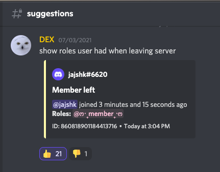
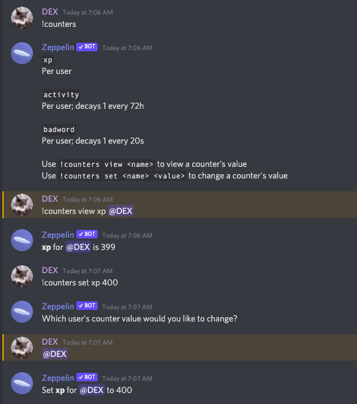
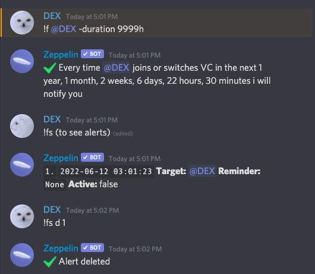

# ZEP BY DEX


**CONSIDER PUTTING A ⭐️ ON THIS REPO**

### What is Zeppelin ?

>Zeppelin is a bot that offers high level of customization, its basically build a bot where you decide what you want the bot to do.

### How to use zep ?

> You use zep via online dashboard, unlike most dashboard you control the entire thing by updating just one file (its called a yaml file). There are various plugins/modules that you enable and customize.

### Where do I start ?

The bot works as follows, you can have levels from 1 to 100. By default, zeppelin assumes mod as level 50, and admin as level 100 but you can change that once you get used to the bot.

**Step 1:** Set the prefix

**Step 2:** Insert role IDs for level 50 and 100

**Step 3:** Type plugins

 This is where you will start enabling modules later on

**EXAMPLE SETUP**

The image below shows what the dashboard looks like after you set all these. In this example we enabled the `auto_reactions` plugin. Note that the `success_emoji` and `error_emoji` are optional if you want to set your own you can but if you dont type anything, it will use the default.


### What plugins are there ?

Whoa!, you here already? What a pro. There are many plugins which I cover in detail.

### Auto Reactions

<details>
  <summary>Click to view</summary>
Often used for suggestion channel, adds reactions to every message on set channel

> 
> 
> *An example of auto reactions being used for a suggestions channel, in this case 👍 👎*

</details>

---

### Automod

<details>
  <summary>Click to view</summary>

**LOOSE MATCHING**

`loose_matching` allows a number of letters
(controlled by `loose_matching_threshold`)
*between* letters for word matching
so e.g. if you wanted to match "hello" and enabled `loose_matching`, it would also match e.g. "h|e|l|l|o"

**ALERT TIP**
`replieduser` is whether or not to ping the user you are replying to

#### USAGE


**AUTOMOD TIP**

>setting up an automod config that insta-bans people if they mention more than 15 people in the same message
 use `mention_spam` with amount 15, within 0s
 as the trigger

`only_full_words`
- if `true`: if it needs to filter `banana` in a message it'll delete `I am a banana` but not `I am a banananan`
- if `false`: if it needs to filter `banana` in a message it'll delete both `banana` and `bananana`

`normalize`
When enabled, the matched text is normalized (converted to alphanumeric) before matching
- Allows matching text even when some letters have been replaced by similar looking letters from other alphabets

`loose_matching` and `loose_matching_threshold`
- When `loose_matching` is enabled, words are matched even when there are other letters or spaces between the letters

- `loose_matching_threshold` controls how many extra letters, at most, can be between the letters (spaces are unlimited). Defaults to 4.


**REGEX TIP**

`(<a?:[\w~]{2,32}:\d{17,19}>)` is an emoji regex for animated and non-animated emojis.


📣 **GOOD TO KNOW**
the default modifier, if not specified, is `>=`


**REGEX TIP**

`((<a?:[\w~]{2,32}:\d{17,19}>)[\S\s]*?){5,}` - Detect 5 or more emoji's in a message. You can replace 5 with whatever you want.


WANT RULES ?

YOU CAN FIND THEM AT [Rules](rules.md)
</details>

---
</details>

### Cases

<details>
  <summary>Click to view</summary>
  
This plugin  shows all the cases in a set channel
>
> 
> *An example of cases channel*

`log_automatic_actions: true` 

Enabling this logs all manually created actions as well , such as when u right click and ban manually instead of using bot commands.

`case_log_channel: "1234"` 

This setting allows you to set the channel for logging all your cases, in this instance, `1234` is the channel ID

⏲️  **RELATIVE TIME**

`show_relative_times: true` This enables the relative time setting

`relative_time_cutoff: 7d` is the amount of time after which `!cases` will show the full date, not a relative time (e.g. "5 hours ago")

so if you set relative time cutoff to 24h, any cases older than 24h would show the full date, e.g. "2021-01-30", rather than e.g. "1 day ago"


`case_colors` [Optional] This setting allows you to customize the embed strip color for various actions such as warn,mute etc. You can either type color names like `yellow` `green` or use hex values such as `2EFF27` which is green.
If you would like to use the default setting, u may delete this part of the code

`case_icons` [Optional] This setting allows you to customize the case icons, you can either use custom emoji like `<:do_not_disturb:841799310797832244>` but note that zeppelin needs to be in the same server as the emote or it wont work or you can use default unicode emojis such as `:boot:`.  If you would like to use the default setting, u may delete this part of the code


```yaml
  cases:
    replaceDefaultOverrides: true #replaces default settings if true
    config:
      log_automatic_actions: true
      case_log_channel: "851837989545050162" #cases channel
      #case_log_channel: *cases
      show_relative_times: true
      relative_time_cutoff: 7d
      case_colors:
        warn: yellow
        ban: red
        unban: 2EFF27 #green
        note: FEE9E9 #whitish
        kick: F34B80 #pinkish
        mute: yellow
        unmute: 2EFF27 #green
        deleted: orange
        softban: F73C4F #Lighter shade of red
      case_icons:
        warn: ":warning:"
        ban: ":hammer:"
        unban: ":green_circle:"
        note: ":pencil:"
        kick: ":boot:"
        mute: ":mute:"
        unmute: ":green_circle:"
        deleted: ":no_entry:"
        softban: ":boot:"
```
</details>

---

### Companion Channels

<details>
  <summary>Click to view</summary>
  
Set up 'companion channels' between text and voice channels. Once set up, any time a user joins one of the specified voice channels, they'll get channel permissions applied to them for the text channels.


`permissions` This number can be calculated using  https://discordapi.com/permissions.html which allows you to set the behaviour of the linked channel (e.g read only channel, visible only on vc join etc.)


**NOTE**

> The companion channels plugin doesn't currently look at member-related information for overrides, so level overrides don't work

#### PLUGIN CODE

```yaml
  companion_channels:
    replaceDefaultOverrides: true #replaces default settings if true
    config:
      entries:
        public_vcs: #name of the entry, could be anything
          voice_channel_ids:
            - "851845471587926086" #vc channel
            #- *vc1
          text_channel_ids:
            - "851845490298454026" #text channel
            #- *text1
          permissions: 52224
          enabled: true
```

</details>

---


### Counters

<details>
  <summary>Click to view</summary>
  
**COUNTER TIP**

>Counter decays are currently processed every 5 minutes. They are, however, still applied according to the decay time, even if it's lower than 5 minutes, so "1 every 30s" would decay 10 points at once every 5 minutes.


**COUNTER DECAY**

> Counter decays are currently processed every 5 minutes. They are, however, still applied according to the decay time, even if it's lower than 5 minutes, so "1 every 30s" would decay 10 points at once every 5 minutes.

</details>

---


### Locate User

<details>
  <summary>Click to view</summary>

PERMISSIONS

`can_where` (see below)

`!where / !w` - Posts an instant invite to the voice channel that member is in
Usage: `!w 108552944961454080` where `108552944961454080` is the member ID

`can_alert` (see below)

`!follow / !f` - Sets up an alert that notifies you any time `<member>` switches or joins voice channels
Usage: `!f @DEX#0001 -d 9999h reminder message`

**HOW TO GET ALERTED WHEN SOMEONE JOINS VC USING FOLLOW COMMAND**

`!f @DEX#5006 -d 9999h reminder message` everytime user joins/leaves vc, zep will ping u

`!fs` shows a list of all your alerts you set up
example output:

`1.` Target: @banana

`2.` Target: @pear

`!fs d 1` deletes the first alert from the list



#### PLUGIN CODE

```yaml
  locate_user:
    replaceDefaultOverrides: true #replaces default settings if true
    config:
      can_where: true
      can_alert: true
```
</details>

---

### Logs

---

### Mod Actions

<details>
  <summary>Click to view</summary>
  
 Use this to set messages for what happens when you warn, ban etc. Who can warn, ban, how many messages to delete on ban. You set all of that in this plugin


</details>

---


### Mutes

<details>
  <summary>Click to view</summary>
  
 Same as above but for mutes


</details>

---


### Persist

<details>
  <summary>Click to view</summary>
  
>  This plugin allows you to restore the roles back to the user when they join the server back. Please note that you need to add every role one by one on the config and if you delete role that was on config, the plugin will break so i recommend you use YAGPDB or carlbot for this instead. 

```yaml
  persist:
    replaceDefaultOverrides: true #replaces default settings if true
    config:
      persisted_roles:

        - "827840992111099935" #Bronze
        - "827841264489725983" #Silver
        - "827841321716678698" #Gold
        - "827841368374247454" #Platinum
        
        - "828659945158737931" #Regulars

        - "808718941785554985" #⭐️ star

        - "832922355009060894" #dexians
      persist_nicknames: true
      persist_voice_mutes: true
```
To view default setting: https://zeppelin.gg/docs/plugins/persist#:~:text=Config%20schema-,Click,-to%20expand


</details>

---


### Pingable Roles

<details>
  <summary>Click to view</summary>
  
`can_manage` allows you to use this plugin and its commands

#### PLUGIN CODE

```yaml
  pingable_roles: #makes a role pingable when you start typing in a specific channel
    replaceDefaultOverrides: true #replaces default settings if true
    overrides:
      - level: '>=100'
        config:
          #Usage: !pingable_role <channelId> <role>
          #To disable: !pingable_role disable <channelId> <role>
          can_manage: true #only level 100 can run that ^
```

</details>

---


### Post

<details>
  <summary>Click to view</summary>
  
`can_post`is what allows users to use this plugin and its commands

COMMANDS

`!edit <message> <content>`


`!edit_embed <message> -title "Title Here" -color #FFFFFF <maincontent>`

`!post <channel> <content>` where optional flags include `-enable-mentions` `-schedule` `-repeat` `-repeat-until` and `-repeat-times`

... something something THIS IS INCOMPLETE OK LET ME LIVE

📮 **SCHEDULED POSTS**

scheduled posts are messages that are scheduled to be posted later, using the `-schedule` option for `!post`,

 e.g. `!post -schedule="2021-02-01 12:00" Some message that is posted on Feb 1 at 12pm`

#### PLUGIN CODE

```yaml
  post:
    replaceDefaultOverrides: true #replaces default settings if true
    overrides:
      - level: '>=100'
        config:
          can_post: true #only level 100 can post (use this plugin)
```

</details>

---


### Reaction Roles

<details>
  <summary>Click to view</summary>
  
Allows you to add reaction roles to a given message.

PERMISSIONS

`can_manage` is needed to use this plugin and its commands


USAGE

**ADDING REACTION ROLES**

To add reaction roles, use the format below!

If the message you specify is not found, use `!save_messages_to_db <channelId> <messageId>`
to manually add it to the stored messages database permanently and try again!

```yaml
!reaction_roles messageid
emoji1 = roleid1
emoji2 = roleid2
```

Example
```yaml
!reaction_roles 800865377520582687
👍 = 556110793058287637
👎 = 558037973581430785
```


**CLEAR**

`!reaction_roles clear MESSAGEID` to clear reaction roles. Incase this does not work, save to database and try again! *see below*

STEPS:

1. `!save_messages_to_db 534722948246929429-858626287895314472`

2. `!reaction_roles clear 858626287895314472`


**REACTION ROLE TIP**

`auto_refresh_interval` for reaction roles sets how often the reactions are "refreshed", i.e. removed and re-added. This is done because high-volume reactions like reaction roles can become very glitchy after some time if they're not reset. To fix this, you can refresh them!

**REFRESH**

`!reaction_roles refresh MESSAGEID` to refresh reaction roles. Incase this does not work, save to database and try again! *see below*

STEPS:

1. `!save_messages_to_db 534722948246929429-858626287895314472`

2. `!reaction_roles refresh 858626287895314472`

#### PLUGIN CODE

```yaml
  reaction_roles:
    replaceDefaultOverrides: true #replaces default settings if true
    config:
      auto_refresh_interval: 900000 #re-adds reactions after x seconds
      remove_user_reactions: true #remove user reaction or let it stay
    overrides:
      - level: '>=100'
        config:
          can_manage: true #only level 100 can manage
```

</details>

---


### Reminder

<details>
  <summary>Click to view</summary>
  

`can_use`

USAGE


#### PLUGIN CODE

```yaml
  reminders:
    replaceDefaultOverrides: true #replaces default settings if true
    config:
      can_use: true
```

</details>

---


### Roles

<details>
  <summary>Click to view</summary>
  
Enables authorised users to add and remove whitelisted roles with a command.

PERMISSIONS

`can_assign` allows you to use this plugin and its commands

`can_mass_assign` allows you to use the mass assign command

#### PLUGIN CODE

```yaml
  roles:
    replaceDefaultOverrides: true #replaces default settings if true
    config:
      assignable_roles: #roles u can add to another user
        - '558037973581430785'
    overrides:
      - level: '>=50'
        config:
          can_assign: true #level 50 and up can assign
      - level: '>=100'
        config:
          can_mass_assign: true # level 100 can mass assign and remove roles
```

</details>

---


### Self Grantable Roles

<details>
  <summary>Click to view</summary>
  
PERMISSIONS

`can_use` allows you to use this plugin and its commands

`can_ignore_cooldown` - Ping dragory and say DEX is asking him to tell what it does so i too can update these cursed docs.

#### PLUGIN CODE

```yaml
  self_grantable_roles:
    replaceDefaultOverrides: true #replaces default settings if true
    config:
      entries:
        basic: #you can have many entries and name them as u like
          roles:
            "851867945760194600": ["test", "tt"] #can have options too!
          can_use: true #can use this entry? since we can have multiple!
          can_ignore_cooldown: false
          max_roles: 1 #maximum no of roles user can pick from the list
      mention_roles: true #mentions the role itself (but no ping)
```

</details>

---


### Slowmode

<details>
  <summary>Click to view</summary>
  
PERMISSIONS

`can_manage` allows you to use the plugin and its commands

`is_affected` if `true`, you are affected by slowmode

USAGE

`use_native_slowmode` uses discord built in slowmode instead of Zeppelins own slowmode. Note that maxmium time is `6h` before bot switches the slowmode from native to Zeppelins version

`!slowmode`

`!slowmode -mode <time>` (mode is optional)

`!slowmode -mode <channel> <time>` (mode is optional)

`!slowmode clear -force <channel> <user>` (force is optional)

`!slowmode disable <channel>`

`!slowmodes` - Shows list of places where slowmode is active

#### PLUGIN CODE

```yaml
  slowmode:
    replaceDefaultOverrides: true #replaces default settings if true
    config:
      use_native_slowmode: true #use discord's built in slowmode (till 6h)
      is_affected: true #everyone except those in override are affected
    overrides:
      - level: '>=50'
        config:
          can_manage: true #can set and manage slowmode commands
          is_affected: false #level 50 and up arent affected by slowmode
```

</details>

---


### Starboard

<details>
  <summary>Click to view</summary>
  
Allows you to pin memories with a reaction!

#### PLUGIN CODE

```yaml

  starboard:
    replaceDefaultOverrides: true #replaces default settings if true
    config:
      boards:
        basic: #starboard no1, u can name anything
          channel_id: "830321220943347772" #ratboard *starboard1
          stars_required: 2
          star_emoji: [":rat:", "🐀"]
          copy_full_embed: true
          enabled: true # The starboard is enabled for all
          show_star_count: true #show the star-count in starboard
          color: 0x000080

        levelonly: #starboard no2, u can name anything
          channel_id: "830321220943347772" #*starboard2
          stars_required: 0
          star_emoji: [":rat:", "🐀"] #multiple various reactions possible!
          copy_full_embed: true
          show_star_count: true #show the star-count in starboard
          #color: 0x000080 if needed
      #can_migrate command can be used to move ("migrate") pins to a starboard
      can_migrate: false
    overrides:
      - level: "100"
        config:
          boards:
            levelonly:
              enabled: true #only for level 100 (admin react = starboard)
```

</details>

---


### Tags

<details>
  <summary>Click to view</summary>
  


💡 **TAG TIP**


`user_tag_cooldown`is the cooldown per user per tag

`global_tag_cooldown` is the global cooldown (server wide) per tag

`user_cooldown` is the cooldown per user (not tag specific)

`global_cooldown` is the global cooldown (server wide) (not tag specific)


🌡 **TEMPERATURE TAG**

**CtoF** `{if(args.0, if(or(eq(args.0, "0"), not(eq(add(args.0, 1), 1))), concat(add(mul(args.0, div(9, 5)), 32), "**°F**"), ":warning: Temperature must be a number"),":warning: Please provide a temperature to convert")}`

**FtoC** `{if(args.0, if(or(eq(args.0, "0"), not(eq(add(args.0, 1), 1))), concat(mul(sub(args.0, 32), div(5, 9)), "**°C**"), "⚠️ Temperature must be a number"),"⚠️ Please provide a temperature to convert")}`

**HEALTH TAG**

A useful tag for users on your server.


<details>
  <summary>Click to view code!</summary>

```yaml
tags:
  replaceDefaultOverrides: true #replaces default settings if true
  config:
    prefix: '!'
    categories:
      "mental":
        tags:
          "health":
            embed:
              title: "Mental Health Resources"
              color: 0xFF0000
              footer:
                text: "Remember, You Matter <3, created by DEX#0001"
                icon_url: https://media.discordapp.net/attachments/770256340639416320/854689949193076737/Medical_31-60_974.jpg?width=523&height=523
              #image:
                #url: https://i.pinimg.com/originals/f6/f6/e6/f6f6e629e0bb1ab4ef763c12b5457074.png
              thumbnail:
                url: https://media.discordapp.net/attachments/770256340639416320/854690141279748096/PngItem_4479310.png?width=523&height=523
              fields:
              -  name: "**National Suicide Prevention Hotline (U.S.):**"
                 value: |
                  **Call:** 1-800-273-8255, available 24/7 for emotional support
                  **Text: HOME** to 741741
                  https://suicidepreventionlifeline.org/chat/

                  Outside the U.S: Find a supportive resource on [this Wikipedia list of worldwide crisis hotlines](https://en.wikipedia.org/wiki/List_of_suicide_crisis_lines)
                 inline: false
              -  name: "**More Support**"
                 value: |
                  For Substance Abuse Support, Eating Disorder Support & Child Abuse and Domestic Violence:
                  [Click to go to Discord's Health & Safety Page](https://discord.com/safety/360044103771-Mental-health-on-Discord#h_01EGRGT08QSZ5BNCH2E9HN0NYV)
```
</details>


**TAGS RESOURCES**


`member / user` here:
https://github.com/Dragory/ZeppelinBot/blob/master/backend/src/plugins/Tags/util/renderTagFromString.ts#L30

base template functions (also available in other places with variables) here:
https://github.com/Dragory/ZeppelinBot/blob/master/backend/src/templateFormatter.ts#L261

tag functions here:
https://github.com/Dragory/ZeppelinBot/blob/master/backend/src/plugins/Tags/TagsPlugin.ts#L116

and a few extra tag things here:
https://github.com/Dragory/ZeppelinBot/blob/master/backend/src/plugins/Tags/util/renderTagBody.ts#L20

useful doc
https://gist.github.com/vcokltfre/8cff17725485f70992c44970f53977fd


#### PLUGIN CODE

```yaml
  tags:
    replaceDefaultOverrides: true #replaces default settings if true
    config:
      prefix: '!!'
      #delete_with_command would delete the bot response when the original message is deleted
      delete_with_command: true
      #user_tag_cooldown is the cooldown per user per tag
      user_tag_cooldown: null
      #global_tag_cooldown is the global cooldown (server wide) per tag
      global_tag_cooldown: null
      #user_cooldown is the cooldown per user (not tag specific)
      user_cooldown: null
      #allow tags to ping?, Can be enabled conditionally via overrides for e.g. only moderators
      allow_mentions: false
      #global_cooldown is the global cooldown (server wide) (not tag specific)
      global_cooldown: null
      #When turned on, the message triggering a tag will be automatically deleted after the tag is posted
      auto_delete_command: false
      categories:
        "general":
          tags:
            "id":
              embed:
                description: |-
                  User id: {user.id}
        "support":
          tags:
            "lost":
              embed:
                title: "Hey there, it seems like you're lost!"
                description: |-
                  This server is the support server for the site **[discord.io](https://discord.io/)**.

                  Through us, anyone can create a custom invite link for free. However, when those links expire, people often get confused and stumble here.

                  We are not the server you intended to join. If you can, please let the person who gave you the link know that it has expired. Thank you!

                  Click for translation: [🇹🇷](https://translate.google.com/?sl=en&tl=tr&text=This%20server%20is%20the%20support%20server%20for%20the%20site%20discord.io.%0A%0AThrough%20us%2C%20anyone%20can%20create%20a%20custom%20invite%20link%20for%20free.%20However%2C%20when%20those%20links%20expire%2C%20people%20often%20get%20confused%20and%20stumble%20here.%0A%0AWe%20are%20not%20the%20server%20you%20intended%20to%20join.%20If%20you%20can%2C%20please%20let%20the%20person%20who%20gave%20you%20the%20link%20know%20that%20it%20has%20expired.%20Thank%20you!&op=translate) [🇵🇹](https://translate.google.com/?sl=en&tl=pt&text=This%20server%20is%20the%20support%20server%20for%20the%20site%20discord.io.%0A%0AThrough%20us%2C%20anyone%20can%20create%20a%20custom%20invite%20link%20for%20free.%20However%2C%20when%20those%20links%20expire%2C%20people%20often%20get%20confused%20and%20stumble%20here.%0A%0AWe%20are%20not%20the%20server%20you%20intended%20to%20join.%20If%20you%20can%2C%20please%20let%20the%20person%20who%20gave%20you%20the%20link%20know%20that%20it%20has%20expired.%20Thank%20you!&op=translate) [🇷🇺](https://translate.google.com/?sl=en&tl=ru&text=This%20server%20is%20the%20support%20server%20for%20the%20site%20discord.io.%0A%0AThrough%20us%2C%20anyone%20can%20create%20a%20custom%20invite%20link%20for%20free.%20However%2C%20when%20those%20links%20expire%2C%20people%20often%20get%20confused%20and%20stumble%20here.%0A%0AWe%20are%20not%20the%20server%20you%20intended%20to%20join.%20If%20you%20can%2C%20please%20let%20the%20person%20who%20gave%20you%20the%20link%20know%20that%20it%20has%20expired.%20Thank%20you!&op=translate)
                color: 0xae7aef
        "tips":
          tags:
            "foo":
              embed:
                title: "Reminder"
                description: |-
                  Bar

                color: 0xae7aef
                image:
                  url: https://media.discordapp.net/attachments/799195773408903188/830388041608593438/Screen_Shot_2021-04-10_at_3.25.26_PM.png

            "!reminder":
              embed:
                title: "Reminder"
                #color: 0xae7aef
                image:
                  url: https://media.discordapp.net/attachments/799195773408903188/830389173210972160/Screen_Shot_2021-04-10_at_3.29.45_PM.png

            "!avatar":
              embed:
                title: "Avatar"
                #color: 0xae7aef
                image:
                  url: https://media.discordapp.net/attachments/770256340639416320/830444957654843413/Screen_Shot_2021-04-10_at_7.11.36_PM.png

            "!jumbo":
              embed:
                title: "Jumbo"
                #color: 0xae7aef
                image:
                  url: https://cdn.discordapp.com/attachments/832964085976530964/834393774426816552/Screen_Shot_2021-04-21_at_4.40.37_PM.png

            "!follow":
              embed:
                title: "Follow"
                #color: 0xae7aef
                image:
                  url: https://media.discordapp.net/attachments/770256340639416320/834398760854618122/Screen_Shot_2021-04-21_at_5.02.26_PM.png
            "gg":
                description: |-
                  Bar
    overrides:
      - level: '>=50'
        config:
          #can user use the tags ?
          can_use: true
          #can user create tags?
          can_create: true
          #can user view the tags list
          can_list: true
          #only level 50 and up will a tag ping
          allow_mentions: false
```

</details>

---


### Time & Date

<details>
  <summary>Click to view</summary>
  
Allows controlling the displayed time/date formats and timezones

PERMISSIONS

`can_set_timezone`

USAGE

Moderators can also set their own timezone with the `!timezone` command.
This affects the output of several commands when ran by that moderator

**To view timezone**

`!timezone`

**To set timezone**

`!timezone <timezone>`

> For example `!timezone Europe/Helsinki`

**To reset**

`!timezone reset`


**TIPS**

**Timezone example:**
```yml
timezone: Europe/Helsinki
```
See <https://en.wikipedia.org/wiki/List_of_tz_database_time_zones> for a list of supported timezones ("TZ database name" column in the table).

**Date format example:**
```yml
date_formats:
  date: "MM/DD/YYYY"
  time: "h:mm A"
  pretty_datetime: "MM/DD/YYYY [at] h:mm A z"
```
See <https://momentjs.com/docs/#/displaying/format/> for a list of values you can use!

#### PLUGIN CODE

```yaml
  time_and_date:
    replaceDefaultOverrides: true #replaces default settings if true
    config:
      timezone: Asia/Karachi
      date_formats:
        date: 'MMM D, YYYY'
        time: 'H:mm'
        pretty_datetime: 'MMM D, YYYY [at] H:mm z'
    overrides:
      - level: '>=50' #level 50 and above
        config:
          can_set_timezone: true
```

</details>

---


### Utility

<details>
  <summary>Click to view</summary>
  

**AVATAR**


**JUMBO**


🚩 **SEARCH FLAGS**

`!s -sort id dex` sort all dex results by ID

`!s -bot` lists all bots

`!s -p 1 dex` search page 1 of dex results

`!s -e` export results (via a link)

`!s -ids` excludes usernames and lists only ids

`!s -re dex` regex search for users named dex

`!s -v` lists all ppl in vc

Examples:
`!s -ids -e dex` exports all ids of users named dex on server
Note: *the results can be used for `!massban` command afterwards*

🗒️ **CLEAN MESSAGES FROM USER AND ADD TO CASE**

`!clear <count> -u userid -c #channel -update`

Note: the `-update` at the end is if you want to add it to their mod log case


**CLEAN COMMAND TIP**

Deletes everything but image attachments


#### PLUGIN CODE

```yaml
utility: #https://zeppelin.gg/docs/plugins/utility/usage
  replaceDefaultOverrides: true #replaces default settings if true
  config:
    #List all roles or roles matching a search
    #!roles [search] -counts -sort
    can_roles: true

    #Show the permission level of a user
    #!level [member]
    can_level: false

    #Search banned users
    #!bansearch <query> [-page] [-sort] [-case-sensitive] [-export] [-ids] [-regex]
    #Search server members
    #!search [query] [-page] [-role] [-voice] [-bot] [-sort] [-case-sensitive] [-export] [-ids] [-regex] [-status-search]
    can_search: true

    #Remove a number of recent messages
    #!clean <count>
    can_clean: false

    #Show information about the specified thing
    #needed for many info sub commands
    #!info [value]
    can_info: false

    #Show server information
    #!server [serverId]
    can_server: false

    #Show information about an invite
    #!invite <inviteCode>
    can_inviteinfo: false

    #Show information about a channel
    #!channel [channel]
    can_channelinfo: false

    #Show information about a message
    #!message <message>
    can_messageinfo: false

    #Show information about a user
    #!user [user] -compact
    can_userinfo: false

    #Show information about a role
    #!roleinfo <role>
    can_roleinfo: false

    #Show information about an emoji
    #!emoji [emoji]
    can_emojiinfo: false

    #Show information about a snowflake ID
    #!snowflake <id>
    can_snowflake: false

    #Reload the Zeppelin configuration and all plugins for the server.
    #This can sometimes fix issues.
    #!reload_guild
    can_reload_guild: false

    #Set a member's nickname
    #!nickname <member> <nickname>
    #Reset a member's nickname to their username
    #!nickname reset <member>
    can_nickname: false

    #Test the bot's ping to the Discord API
    #!ping
    can_ping: false

    #View the message source of the specified message id
    #!source <message>
    can_source: false

    #Move a member to another voice channel
    #!vcmove <member> <channel>
    #Move all members of a voice channel to another voice channel
    #!vcmoveall <oldChannel> <channel>
    can_vcmove: false

    #Disconnect a member from their voice channel
    #!vcdisconnect <member>
    can_vckick: false

    #Show a quick reference for the specified command's usage
    #!help <command>
    can_help: false

    #Show information about Zeppelin's status on the server
    #!about
    can_about: false

    #Get a link to the context of the specified message
    #!context <channel> <messageId>
    can_context: false

    #Makes an emoji jumbo
    #!jumbo <emoji>
    can_jumbo: false
    jumbo_size: 128

    #Retrieves a user's profile picture
    #!avatar [user]
    can_avatar: false

    info_on_single_result: true
  overrides:
    - level: '>=50'
      config:
        can_roles: true
        can_level: true
        can_search: true
        can_clean: true
        can_info: true
        can_server: true
        can_inviteinfo: true
        can_channelinfo: true
        can_messageinfo: true
        can_userinfo: true
        can_roleinfo: true
        can_emojiinfo: true
        can_snowflake: true
        can_nickname: true
        can_vcmove: true
        can_vckick: true
        can_help: true
        can_context: true
        can_jumbo: true
        can_avatar: true
        can_source: true
    - level: '>=100'
      config:
        can_reload_guild: true
        can_ping: true
        can_about: true
```

</details>

---

### Welcome Message

<details>
  <summary>Click to view</summary>
  
Send a welcome message in dm or in a channel

> 
>
>*Example of message sent to dm*
 

For more info on this plugin [Click Here](welcome_message.md)

</details>

---


### Others
The following plugins are very old and outdated now so I will not cover them but those are:

- [Autodelete](autodelete.md) (deletes everything in channel after x seconds)

- `spam_protection` (Use `automod` instead)

- `censor` (Use `automod` instead)

[Automod & Counters](automod+counters.md)
[Click here](autoreactions.md)
[Automod Rules](rules.md)

[Companion Channels](companion_channels.md)
[Locate User](locate.md) 
[Click here](logs.md)
[Miscellaneous](miscellaneous.md) 
[Mutes & Mod actions](mutes&modactions.md) 
[Persist](persist.md) 
[Pingable roles](pingable_roles.md)
[Post](post.md) 
[Reaction Roles](reaction_roles.md)
[Reminders](reminder.md)
[Roles](roles.md)
[Self grantable roles](self_grantable_roles.md)
[Slowmode](slowmode.md)
[Starboard](starboard.md)
[Tags](tags.md)
[Time and Date](time_and_date.md)
[Utility](utility.md)

</details>

--- 


See https://zeppelin.gg/ for more details.


### DEX'S CONFIG

Coming soon

## Contributing
Pull requests are welcome. For major changes, please open an issue first to discuss what you would like to change.
## More Info

You can also find me on the zeppelin support server

[](http://discord.gg/9bCGvGw5rT)

You can join my server and follow github channel for updates or to play with Zeppelin there (since you cant use zeppelin on Zep support server)

[](http://discord.gg/JCZf3sHYpE)

